  

Google今年二季度的财报，整体看业绩表现其实并不差。尤其是云收入增速以及继续健康增长的积存订单规模（Backlog），这是力证AI“投得其所”的关键指标。

但这份和Q1几乎相同的剧本，却收获了一个完全不同的市场反应——绩后下跌7%。这还是在Gemini 3.5 Pro多次延期上线拖累多头情绪、股价已有回调的基础上。

对AI投入回报比的不确定性担忧，无疑是市场反馈消极的根源。尽管积存订单突破5000亿超预期，但绩后关于Google 超8000亿的支出承诺，反而引起了市场热议。

那么如何看待管理层仍然积极的Capex明年展望？强劲的业绩vs崩塌的现金流，Google的撕裂叙事下，是继续保持信仰还是作壁上观？本篇海豚君围绕以上问题来聊一聊。

  

以下是详细分析

  

一、疯狂的投入？实际是“补作业”

在业绩电话会上，对于明年的Capex，Google管理层照例没给定量的指引，但定性表述上依然是近两年的口吻——原话“We continue to expect our CapEx to increase significantly in 2027”（预计2027年CapEX大幅增长）。

绩后买方资金对Google明年资本开支的预期，已经上调到3500亿以上，隐含增速>75%。如果按照明年收入22%的市场预期，Google的Capex占收入比重接近60%，意味着不仅要把当期所有的经营现金流都用完，还需要额外动用储备现金或者额外融资。

考虑到年初Google刚薅了850亿的股权融资回血（点评可回顾《[Google向天再借800亿](https://mp.weixin.qq.com/s?__biz=MzE5MTU3MzA2OQ==&mid=2247573458&idx=2&sn=9997e50061cb7c598d795b3b2a9f20f0&scene=21#wechat_redirect)》），后续回购来用来充公为资本投入、现金不留余的情况下，理论上可以支撑今明两年的投入。但这种“疯狂”在一向“沉稳”的Google身上，仍属罕见。

反过来，也可以说Google的投入动作慢了。在微软、Meta、亚马逊在2024年初就开始快速拉高Capex/收入比率时，Google全年几乎保持该比率持平无太大变化。直到2025年，Google的Capex才真正意义上加速。

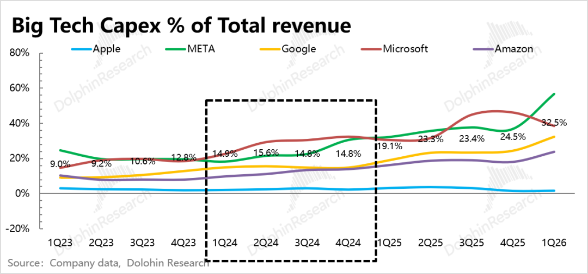

但从投入到完成部署，一般还存在一个1-2年的周期。因此在2026年之前，Google的算力部署，无论是存量还是增量，在云大厂中都不算领先。

根据“在建工程”的变化节奏，25年底Google才看到明显新产能的规划。根据Aterio的跟踪，去年6月至今年6月Google在建产能在头部云厂商中占了31%。

和同行对比看，在产能投建的积极性上，目前仍然是亚马逊和Meta领先，而微软已经选择保守。

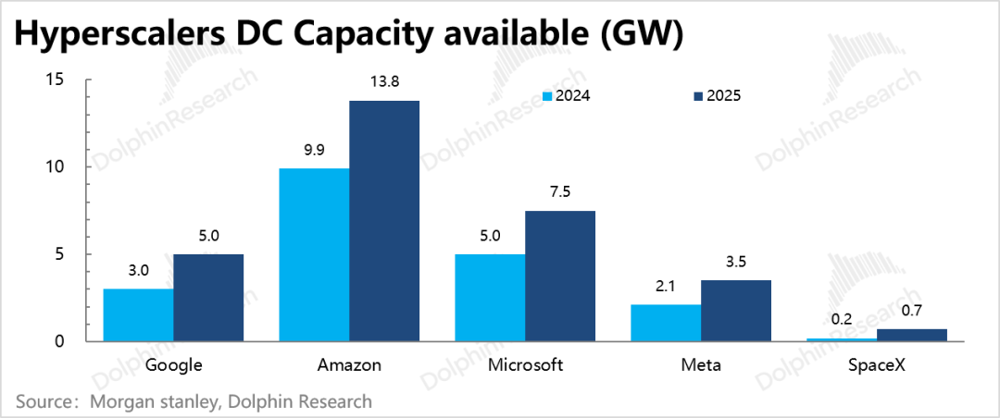

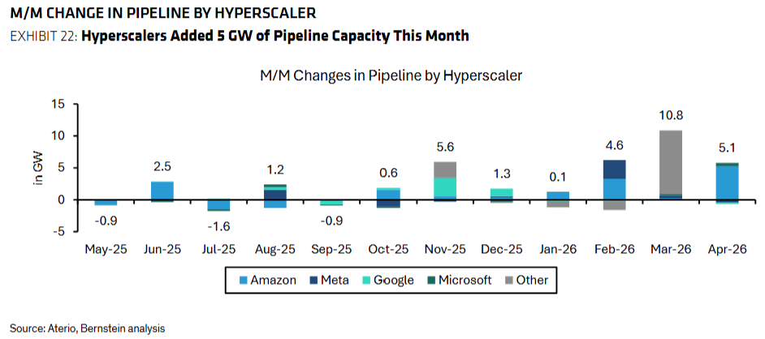

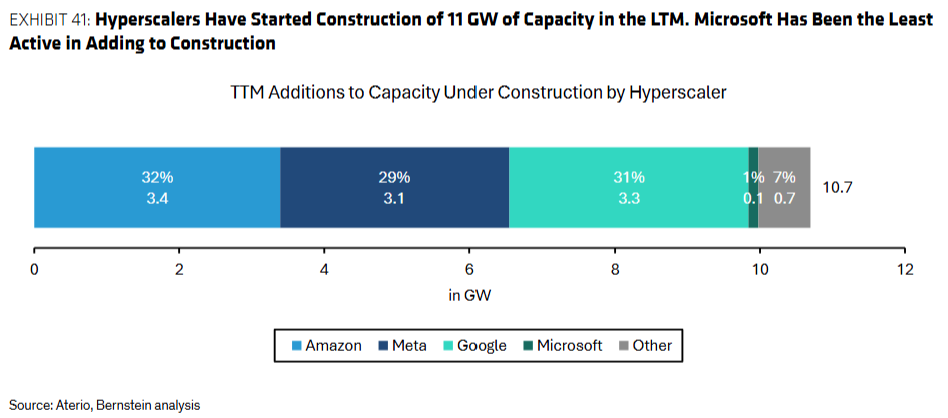

Google这个供需缺口问题在26年上半年仍然严峻：

一方面需求在加速爆发。去年末有Gemini 3和性能大幅提升的TPU v7发布，以及年初以来由OpenClaw、Skills以及Claude Opus 4.6发布等事件催化。

另一方面产能供给仍然受到物理建设的硬性约束。直到今年上半年，Google的在建工程规模占设备资产的规模，才从去年稳定的30%快速拉到38%。

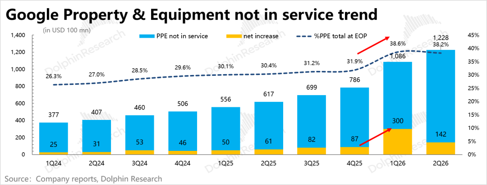

Q1在建工程净增额达到300亿，而当期Capex投入也就357亿，这说明Google当期可能增加了新数据中心的投建，但这个产能从开工到部署完成仍然需要至少一年的时间。

这种软件创新带来的需求爆发，碰上因物理建设导致的产能硬件约束，就会放大短期的供需缺口问题，从而导致即期算力价格、部署成本的同时飙升——xAI短期租赁价格是长期合同价格的3-4倍、CoreWeave 算力成本从300亿美元/GW上涨到350亿美元/GW。

在电话会上，管理层也反复表达产能供不应求。我们看到，当期收入与上一季度Backlog之间的转化率也在持续下降。

因此Google管理层表示后面会考虑将订单“外包”给第三方平台承接，而这会影响到云业务的后续利润率表现。

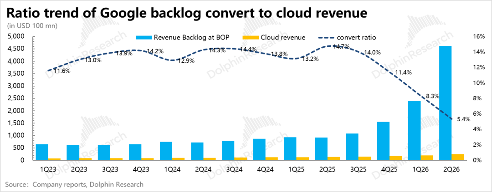

二、并非盲投，而是订单驱动

今年Capex大概率按指引区间顶格投满了，也就是2000亿出头，市场预期也相对一致。不过对于明年的Capex，由于公司没给定量指引，资金的预期分布范围较大，从不足3000到4000亿不等，增速区间在50%~100%。

海豚君认为，Google管理层的投入态度上是明显偏积极的，主要底气就在于手上握有的5140亿待履约订单（Backlog）、以及同比翻了数倍的新增订单。用管理层的话来说，他们是看到了具有吸引力的回报率，才决定重金投入。

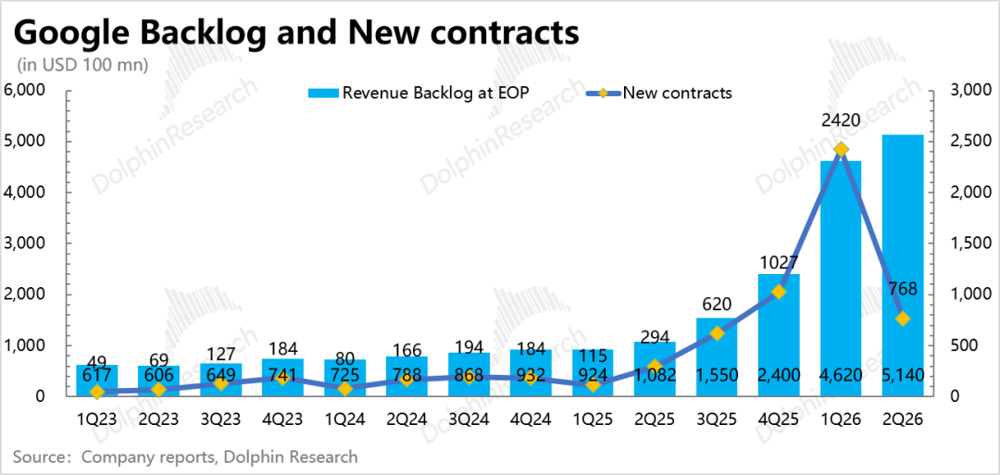

因此我们模拟管理层视角，分别从订单所需的新增算力产能，和以维持稳定ROI区间，两个维度，来判断明年的Capex投入规模。

1\. 订单→所需算力产能→Capex

这是目前市场上相对主流的估算方法，即：从目前在手订单所需要的算力产能，来计算需要新增投入的Capex，然后再加上集团维持性的Capex（目前基本占比较小且低速变化），最终计算得所需要投入的Capex规模。

这里我们不做展开，简化测算过程：

（1）要消化未来2年2570亿的订单需求（Backlog 50%为24个月），按照短中期每年150亿/GW的租赁价格，总计需要17GW。

（2）按照1-2年的部署周期，要满足27、28年需求，因此在扣除25、26年的新增算力情况后，再看还需要在27年投产多少。

结合投行和咨询机构估算，25、26年合计新增近8GW，那么27年还需要额外投建17-8=9GW产能。按照350亿/GW（因存储等模组材料涨价，原300亿部署成本提升到350亿），合计需要投入3150亿美元。

再加上原本需要正常维系的Capex投入500多亿（增速按25%计算），一共3650亿。

2\. 过去ROI→预估未来新增订单→Capex

如果是站在回报率的视角，如何判断当下的投入节奏？毕竟站在现阶段，由于AI发展曲线的非线性，没有谁能够笃定的去算清当下投入、未来产出的ROI。

海豚君想到电话会中，管理层用来表述产能供不应求的一个例证——尽管公司过去三年已经相对往年扩大了投入敞口，但供需缺口依然较大。

这说明管理层在判断投入节奏时，往往会去回溯过去同一时间段，比较“投入额”与“订单额”之间的比例。

我们将历史数据拉了一下，发现以12个月为一个周期，同一个周期内Capex占到新增订单额的比例，大多落在65%-85%区间内，我们将这个视为基于需求能见度来把握投入节奏的ROI控制指标。

但从2025年下半年，订单增速开始向上“失控”之后，Capex投入没有及时跟上，从而导致两者比例迅速回落到目前的30%以下。

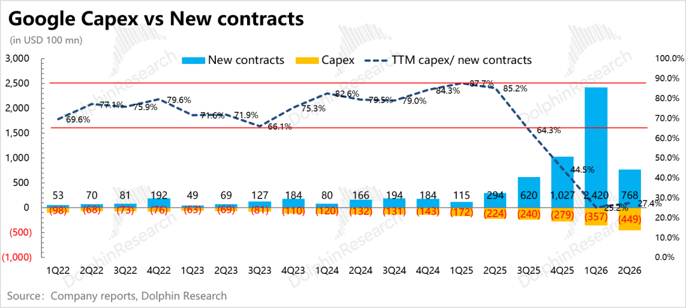

因此，哪怕后面没有新增订单，Google也要大约补上这大半年的投资缺口（按70%比例，海豚君估算约2060亿）。不过2028年TPU 8i/8t量产，提前下定的新增订单应该不会少，更不至于没有。

我们哪怕按照每季度500亿的新增订单需求（考虑到2026年因为有Anthropic等特殊长期协议的计入、TPU第八代明年量产出货，以及今年供需矛盾达到相对极致的非正常状态，我们按照2025年平均每季度新增订单514亿来估算），一年2000亿，按照65%-85%的投入占订单比，对应1300-1700亿的新投入。

再加上前面的2000亿上下的投资缺口，2027年合计要投入3300-3700亿。

结合<1-2>，从需求角度（订单）看，Capex基本在3000-4000亿，大区间和市场预期差不多，说明市场也大多从需求端角度估算所需要的资本投入。

三、风险不等对：5000亿订单vs 8000亿承诺

依照上面的测算，3500亿的投入，基本寄托在这5140亿Backlog订单入口上。若最终按期兑现，24个月内能够确认50%以上的收入，那么Google的重金才算投得其所。

强如Google，其对订单转化和客户的需求追踪预测应该有相对成熟、严密的一套测算体系，因此它承诺的“未来50%订单额将在24个月之内转化确认为收入”的置信度，正常而言是相对较高的。

但风险也并非完全没有，海豚君通过对比发现，Google的Backlog单纯论兑现质量，可能与美光的长协还有差距。

而与此对应的是出口——8000亿的对外支出承诺和与SPV之间的信用背书，这本质上是Google将未来的投入+运营支出（芯片、数据中心、电力、内容授权等）先和供应商将产能和价格锁定下来了，同时还动用自己的AAA级信用，以表外的方式在未来承担了一笔潜在违约金。

换句话说，如果算力产能缺口持续紧张，上游原材料价格高居不下，那么Google这一步棋是相对有利的。反之，如果算力过剩，那么Google也会因此而迎来双压——Backlog兑现不力，但采购行为已经发生、承诺的违约金也需要照付。

因此关键的风险判断，在于一端是收入订单，一端是采购合同，哪个具有更高的约束性？对Google而言，风险敞口更偏向哪一边？

1\. Backlog：有约束但不多

美光的长协，有几处比较关键的约束条件：规定期限、限定价格区间、现金押金等。

其中限定价格区间，避免了合同额不变下，因行业供需变化，交付量要增加的“被迫贱卖”情况。

而220亿美金的押金，达到合约最低价下的累计应收的22%。这笔预收款项也相当于美光拿着一部分客户的钱去投产，变相减轻了自己的重资产属性。

对比Google的Backlog，虽然这里的定义已经剔除客户可自由取消的部分合同，意味着5140亿的Backlog，都多多少少具备客户的一定承诺。

但问题是Google并未强制要求客户交收一笔押金以允诺合同到期正常执行。具有预收性质的递延收入，Q2为73亿，只占到5140亿的1.5%，起不了什么约束作用。如若客户无力支付履约合同，甚至破产清算，Google只能临时紧急寻找别的买家。

更何况，这里面还包含不少Google Play的C端订阅流水预收，因此递延收入对Backlog的约束性可以忽略不计。

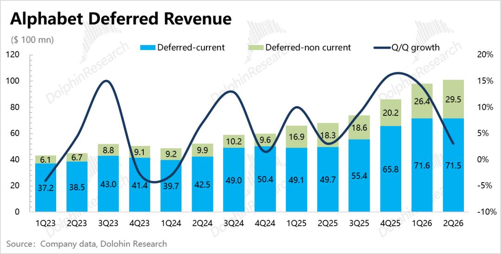

除此之外，这些待履约合同中，是否规定了价格区间、消耗周期，也非常关键。目前Tokens降价已是大趋势，虽然靠着高阶模型的渗透和短期算力供需极致错配，临时性的算力价格还非常夸张。但很显然，这种现象不可持续。

Google一向喜欢将算力搭配大模型API一起出售，而Gemini的迭代已经落后，如果不能及时推出SOTA前沿模型，那么不可避免的要走价格战的老路。

如果Google与客户签订的是固定金额合同，或者在云业务合同中比较常见的“特定周期内的最低消耗金额合同”，那么到时候可能会出现，消耗同等价值的Tokens，需要更久的消耗周期（提供的Tokens量变多）。

除此之外，Google也存在用自己的钱去买订单的情况：

去年下半年开始飙涨的Backlog，存在Anthropic的贡献，包括了400亿TPU算力采购在内的整体5年2000亿合作框架，2000亿的合同并非实打实。

4月Google宣布对Anthropic分阶段增持400亿（其中100亿以3500亿估值时点投入，在已有的14%的股权上进一步做后续融资股权稀释的预防性投资），这可以说是Google看好自己的客户，在提供服务的同时，顺便做一笔投资。至少短期来看，这笔投入在Q2已经给账面收益赚到了近800亿。

但这个操作和英伟达-OpenAI之间的循环融资无异，也是一种拿自己的钱换订单的一种方式。在Anthropic顺风、估值水涨船高的时候，放大了这笔操作背后的利益——做高了Backlog，增厚了投资收益，双赢结果；

反之，一旦Anthropic竞争壁垒削弱，ARR增速边际放缓（比如6-7月），可能会引发估值调整。那么首当其冲Google的EPS会恶化，其次就是2000亿的5年长期订单根基也不稳了。

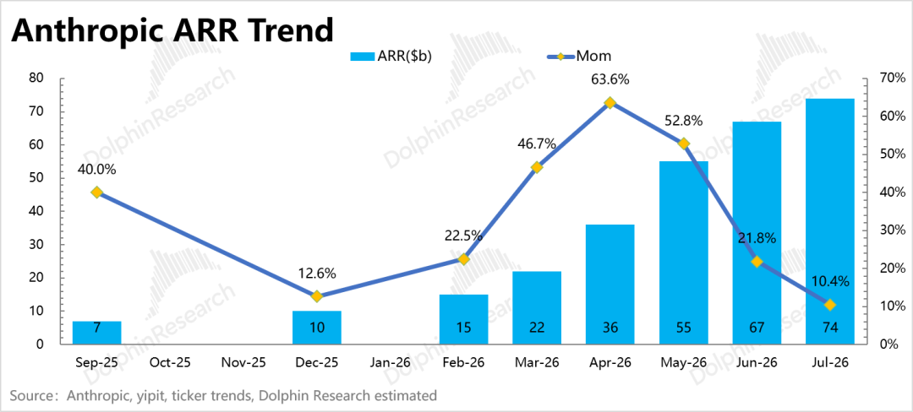

2\. Purchase Commitment：似乎有更高的硬约束

8110亿美元是 Alphabet 在 2026 Q2 10-Q 里披露的已签约但尚未履行的采购承诺，由于相比Q1而言，Q2一下子净增了3000亿，这种不计入当期IS表，也不计入BS表的隐形“债务”飙升，一下子引来媒体的关注。

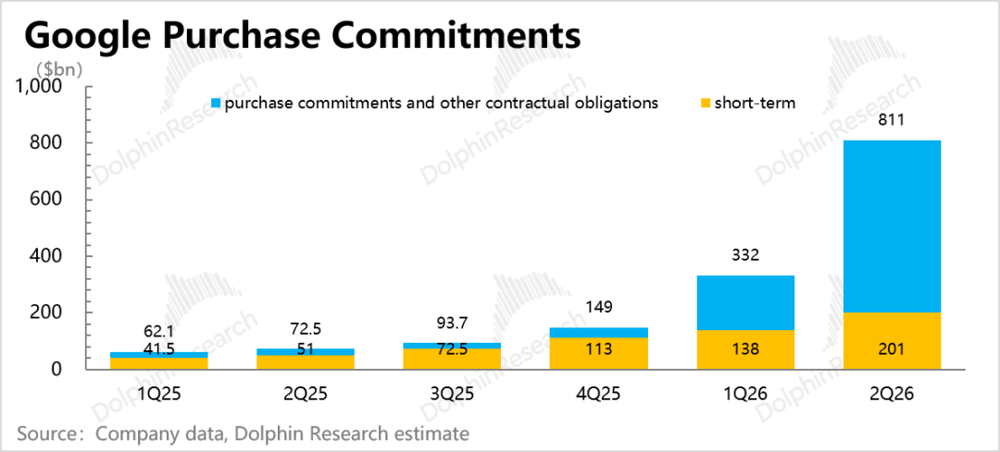

这个支出承诺，是一笔多年的义务，但其中1年之内需要承兑的金额有2000亿。其中，大部分应该会转化为未来的Capex，少部分为Opex。

从承诺的约束性条款来看，8110亿的支出承诺中，有固定金额或有担保的承诺有7070亿（约为1年以上合同），绝大部分是为技术基础设施和库存锁定未来产能的长期供应协议，此外还有能源服务协议和内容授权。

理论而言，这个固定承诺仍然可以违约。不过这里面，北美供给瓶颈相对严重的“能源”合同，其约束性最硬——能源服务协议期限2到26年、义务延伸至2054年，普遍带有“照付不议”的最低采购量条款和实质性的终止罚金（违约退出成本较高），这一块承诺整体预计在2030年前履行完毕。

但在8110亿的支出承诺之外，Google的两类信用担保也值得注意。Google为这些SPV提供租金偿付、能源设备采购的兜底，也就是说，如果SPV无法兑付，那么由Google承担担保范围内的金额偿付，并且保留底层租约或设备所有权，收归自用或直接外租。

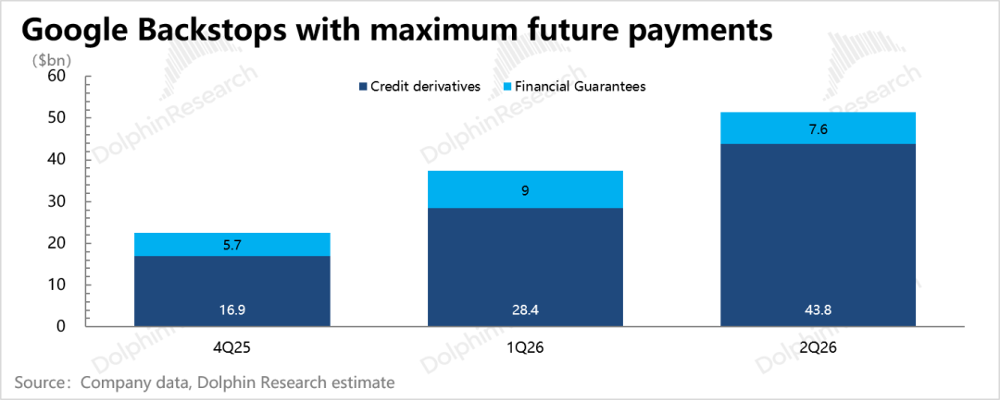

虽然相比8000亿的支出承诺，其担保额显得规模不大，但这部分是一旦SPV违约，Google同样没理由拒绝赔付。

这部分其实和Meta与Blue Owl的300亿合作类似，只不过相比Meta，Google还可以借助这部分实质为自建产能的表外数据中心，扩大TPU的影响力。

总的来看，Google目前是“潜在义务”相比“未来权利”的理论约束性更强。当然，在算力供给缺口较大的短期，权利的兑现概率会比义务更高，看上去风险系数没那么高。

回报的风险与义务的确定，不对等的背后其实等于Google现在的云投入已经把公司变成了重资产性质的风险博弈——拿当下所有的现金流再加杠杆，去博弈一个AI未来的超额回报。

这种新的生意特征会取决于行业的下游AI模型和应用的进展以及风险偏好，让Google这种稳健资产的定价逻辑，反复在奖励成长溢价和AI回本质疑之间撕扯。

因此，在前景确定之前，衡量Google价值的核心，就是找到这个中间的极致悲观和极致乐观的空间。

四、被掩盖的盈利疲软

在大家不满自由现金流转负之际，海豚君发现，Google的经营利润率却没有出现同步崩溃，连小崩的迹象都没有。而对于光看EPS的投资者而言，则更是被股权增值部分（SpaceX、Anthropic等）的900多亿收益掩盖了真实利润表现。

除此之外，Google云业务与同行可比的利润率情况，实际也没公司披露的那么高。虽然改善趋势依旧存在，但利润率绝对值的高低，仍然会影响SOTP下对云业务的独立估值。

1\. 高额摊销折旧已在路上

满打满算下，Google的Capex有明显增长已经自2023年底起持续了两年多，平均增速保持在50%以上，但同期的折旧费用增速还徘徊在30%左右。

管理层前两年对服务器等折旧周期的拉长固然是一个对冲因素，但比较Q1&Q2情况，还有因在建工程而暂时压低。

这也是我们上文提及的，今年以来在建工程规模占到总物业设备资产的比重，从去年的30%一下子提到了38%，体现的是上半年建设速度变慢。

在建工程是正在建设、还未提供服务的物业设备资产，这部分并不计入当期的折旧摊销额中。从而导致了上半年的折旧费用增速仍然在40%，并未与已经翻倍增长的Capex变化同步。

Q2在建工程净增额占到当期Capex比重已经从Q1的异常值84%快速下滑到32%，但距离往年正常水平25%还有一段距离，我们假设Q3、Q4逐步回归到28%、25%。同时在预估今年Capex在2000亿水平的基础上，最终计算得下半年的折旧费用将开始加速。

按年来看，海豚君预计折旧费用的增速巅峰在2027年，影响Google近2个点的经营利润率。这不是影响最大的时候，高投入下的折旧累积效应，直至2030年还将继续拖累Google 相较2027年近4个点的利润率。

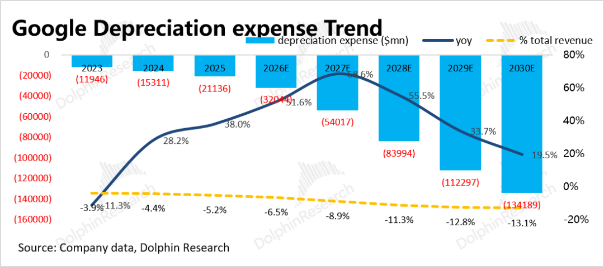

以下是海豚君从芯片出货→算力GW部署→Capex→折旧费用的计算过程中，所涉及到的关键假设图表。值得一提的是，由于价格、产能建设时刻在变化，因此仅供当下简单参考：

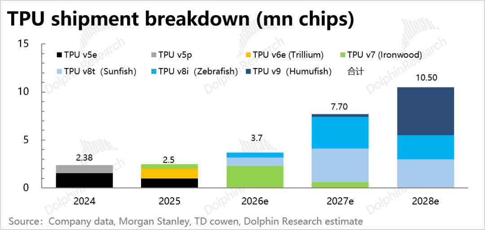

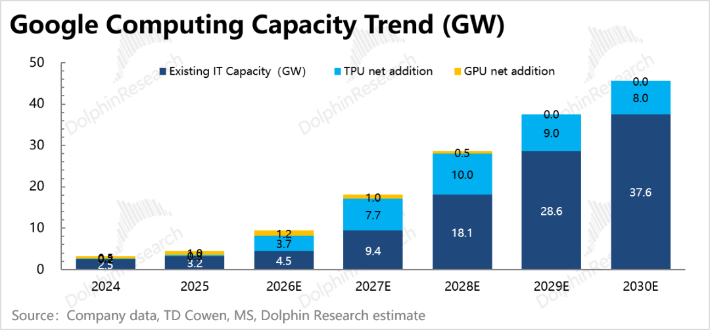

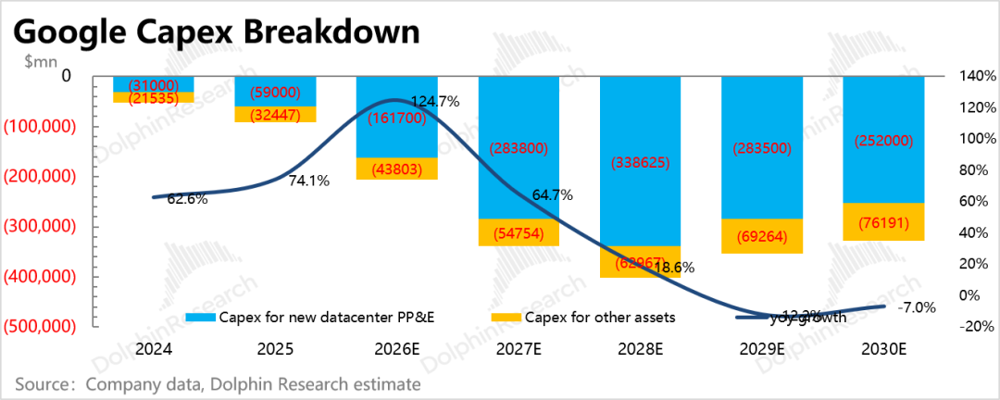

2\. 藏起来的训练成本

除了折旧摊销费用之外，云业务的真实利润也有玄机。按照公司对模型训练研发团队（前后包含DeepMind团队、Brain团队、Google Research部分人员）的组织架构调整来看，从2023年开始，上述三个团队依次进行调整、合并。

最终以统一后的DeepMind团队形式提供面向全公司可共享的基础技术研究。在财务架构上DeepMind归为集团层面，也就是Alphabet-level activities。除了DeepMind之外，集团层面的经营收支还包括集团总部的物业设施投入、折旧，以及监管罚金等。

但如果要将Google 与同行做对标，那么最好还是将这部分模型训练成本重新计入到云业务中。海豚君以这一轮AI发展之前的2022年经营亏损视为集团层面训练模型之外的支出，随后按照5%持续低速增长。

由此拆出集团层面的其他支出项规模，将其视为训练模型相关研发支出，挪到云业务部门进行确认，调整后的经营利润要比原披露的云利润率低个20pct，但好在整体趋势仍然是持续改善的。（需要注明：上述估算并不准确，主要看大概的趋势变化）

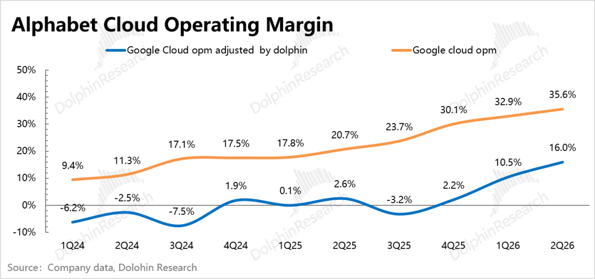

五、小结：撕裂的情绪下，等待叙事的东风

在当前市场对AI的矛盾情绪下，Google的叙事也没年初那么顺了（或者说资金没那么多信心了）。更何况，越来越高的Capex，给未来利润和现金流带来的沉重负担是一方面，Gemini大模型迭代落后对API潜在收入增速的影响是另一方面。

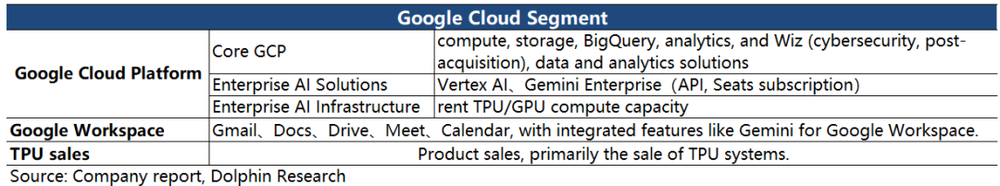

虽然电话会上，管理层着重提及了企业 AI解决方案对云收入的贡献（Q2首次成为Cloud最大增长驱动力，基于GenAI模型的产品收入同比增长近800%），以及Gemini Enterprise付费用户环比增长40%，Seats和API采用量均9倍增长。Gemini模型也通过API处理量从上季度的每分钟160亿到220亿，环比增长38%。

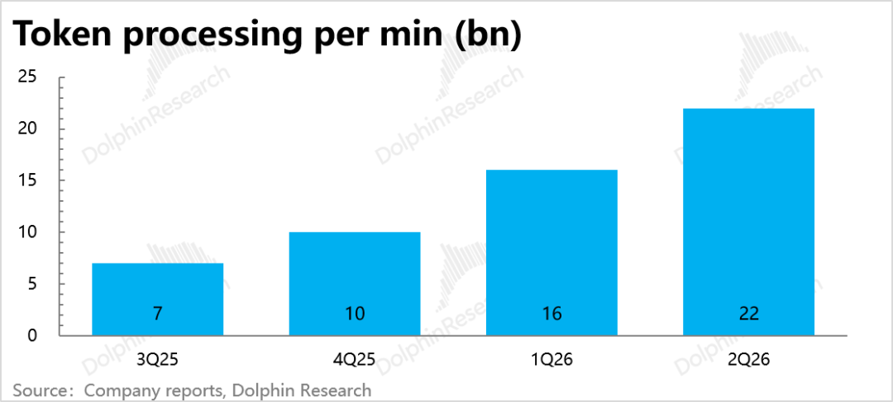

但在Google的潜在义务越来越高下，对权益的高兑现压力也会越来越大。

因此更稳妥的方法是，在目前的多空焦灼消化估值之际，寻求适合自己风险偏好的安全垫厚度，然后蹲守Gemini 4（一款参数量更大、专注Coding编程和自主Agent）发布后带来的催化。

目前管理层透露Gemini 4预训练效果不错。如果我们按常规的迭代周期来看，预计1-2个季度有望看到Gemini 4揭开面纱。

<此处结束>

  

  

  

\- END -

  

  

  

**/****/****转载** 开白

本文为海豚研究原创文章，如需转载请添加微信：dolphinR124 获得开白授权。

  

**/****/****免责声明及** 一般披露提示

本報告僅作一般綜合數據之用，旨在海豚研究及其關聯機構之用戶作一般閱覽及數據參考，並未考慮接獲本報告之任何人士之特定投資目標、投資產品偏好、風險承受能力、財務狀況及特別需求投資者若基於此報告做出投資前，必須諮詢獨立專業顧問的意見。任何因使用或參考本報告提及內容或信息做出投資決策的人士，需自行承擔風險。海豚研究毋須承擔因使用本報告所載數據而可能直接或間接引致之任何責任或損失。本報告所載信息及數據基於已公開的資料，僅作參考用途，海豚研究力求但不保證相關信息及數據的可靠性、準確性和完整性。

本報告中所提及之信息或所表達之觀點，在任何司法管轄權下的地方均不可被作為或被視作證券出售邀約或證券買賣之邀請，也不構成對有關證券或相關金融工具的建議、詢價及推薦等。本報告所載資訊、工具及資料並非用作或擬作分派予在分派、刊發、提供或使用有關資訊、工具及資料抵觸適用法例或規例之司法權區或導致海豚研究及／或其附屬公司或聯屬公司須遵守該司法權區之任何註冊或申領牌照規定的有關司法權區的公民或居民。

本報告僅反映相關創作人員個人的觀點、見解及分析方法，並不代表海豚研究及/或其關聯機構的立場。

本報告由海豚研究製作，版權僅為海豚研究所有。任何機構或個人未經海豚研究事先書面同意的情況下，均不得(i)以任何方式製作、拷貝、複製、翻版、轉發等任何形式的複印件或複製品，及/或(ii)直接或間接再次分發或轉交予其他非授權人士，海豚研究將保留一切相關權利。

  

  

  

**文章不易，点个 “分享”，给我充点儿电吧~**