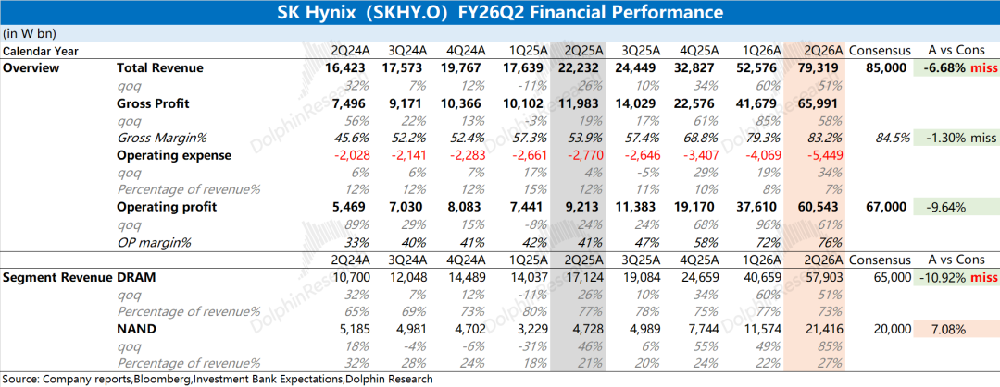
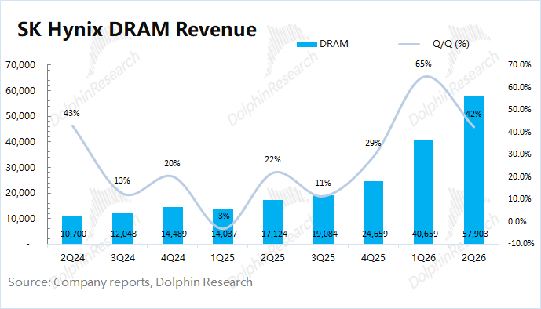
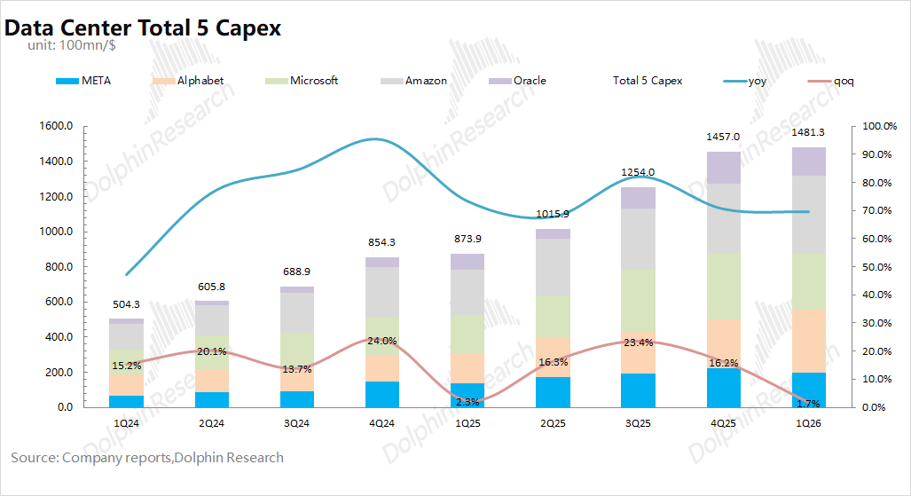
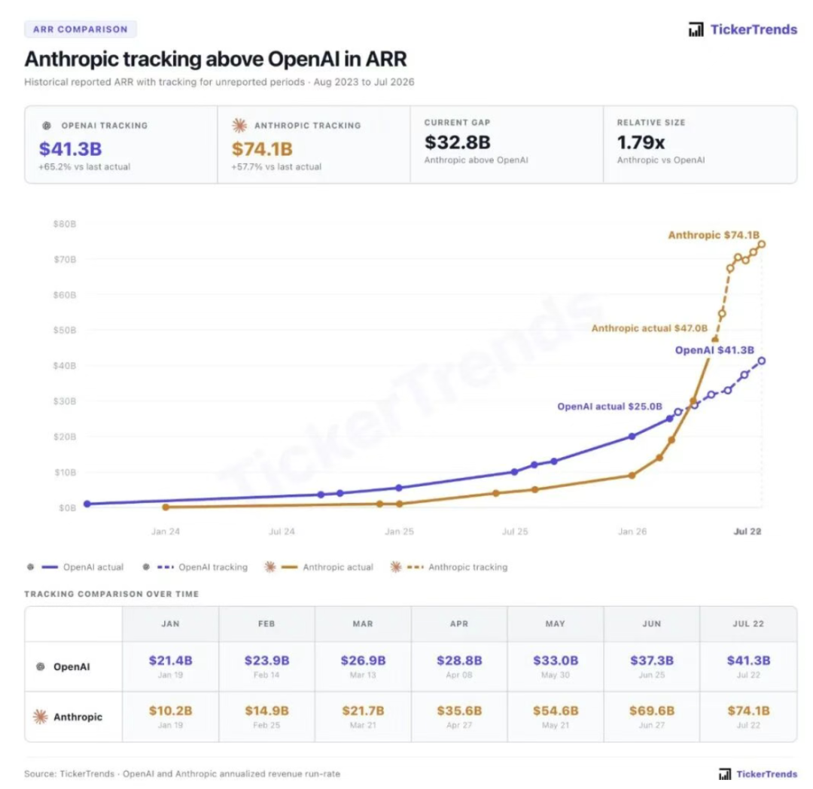
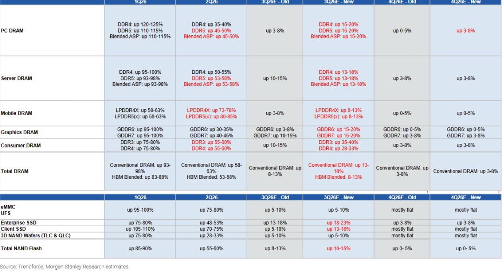
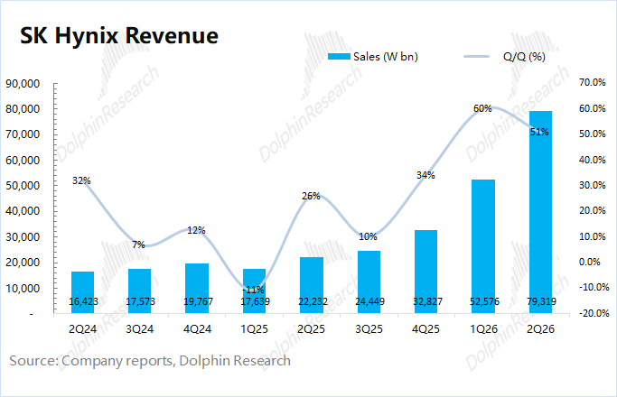
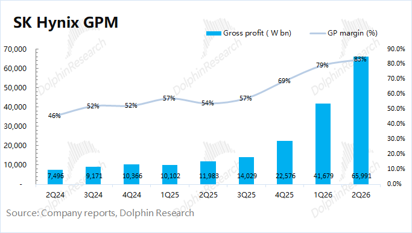
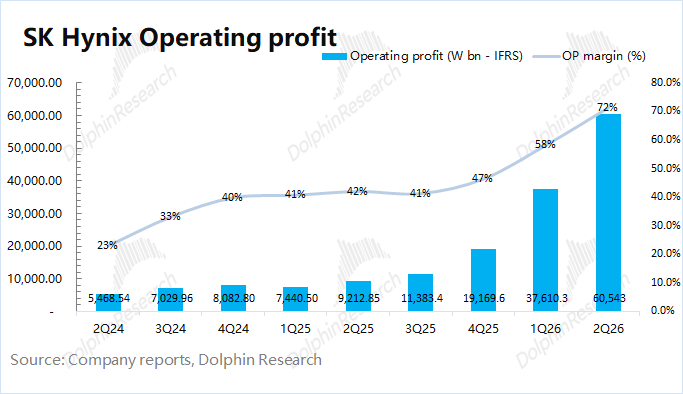
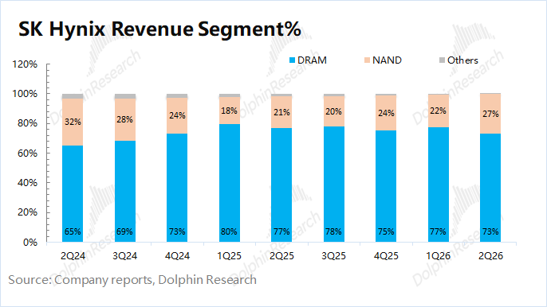

  

海力士 (SKHY.O) 北京时间 2026年7月29日上午，美股盘后发布2026财年第二季度财报（截至2026年6月），要点如下：

1、核心数据：海力士本季度实现营收79万亿韩元，环比增长51%，低于市场预期（85万亿韩元），主要来自于DRAM和NAND业务增长的双重推动，实质上最大的因素是存储产品的涨价。

本季度毛利率为83%，低于市场预期（84-85%），主要来自于DRAM和NAND产品价格上涨的带动。由于公司毛利率已经达到80%+，进一步上行的空间相对有限。

2、核心经营利润：海力士本季度核心经营利润为60.5万亿韩元，环比增长61%，低于市场预期（67万亿韩元），增长主要来自于收入高增和毛利率的提升。

其中公司本季度核心经营费用（研发费用+销售及管理费用）为 5.4万亿韩元，环增34%。在收入大幅增长的情况下，本季度公司核心经营费用率下降至7%。

3、业务情况：公司业务都围绕于存储领域，其中收入基本全部主要来自于DRAM和NAND。

a）DRAM业务：本季度收入57.9万亿韩元，环比增长42%。其中本季度出货量环比增加8%左右（高个位数），价格环增约30%左右，远低于二季度传统DRAM环增55%的表现。这是因为公司此前将产能切换至HBM，传统DRAM的敞口相对较小。

HBM进展：HBM4在二季度开始出货，下半年产能爬坡；HBM4E在上半年已经送样。 

b）NAND业务：本季度收入21.4万亿韩元，环比增长85%。其中本季度出货量环比增加15%，价格环增50%+，与NAND市场价格涨幅相近。

海豚君整体观点：赚多少已是旧账，能扛多久才是新账

在存储大幅涨价的预期之下，海力士的本次财报是“不如意”的，其中收入端和毛利率的表现都低于市场预期。

具体来看，海力士本次财报中不及预期，主要来自于DRAM业务（占总收入的7成以上）。海力士本季度DRAM业务环增42%，其中出货量增长高个位数（8%左右），DRAM产品均价环增约30%。

对比于二季度传统DRAM的市场价格环增50%+，海力士的均价上涨是明显偏弱的。这是由于海力士此前将更多的产能转向HBM领域，这也导致公司在传统DRAM的敞口是相对较小的，近期的涨价效应对公司业绩拉动也没能达到市场的期待。

公司的全年指引（符合预期）：①2026年DRAM出货量同比增长25%左右；NAND出货量同比增长18%左右；②2026年资本开支将达到40-45万亿韩元附近，大致对应300亿美元左右，市场预期（42-45万亿韩元）。

“盘后-10%”的下跌，是对公司本次“不及预期”业绩的直接回应。而“随后拉升”，主要是对公司在PPT中首次官方确认LTA中包含预付款等财务机制，但依然还未披露任何具体金额（美光披露了预付款和RPO）。

海力士本次财报的“LTA增量信息”：公司LTA落地10笔，是包含保证金的（首次官方确认），其中包括核心客户，合同期限通常5年。不同客户、不同产品的条款是不同的。

在海力士的本次财报之外，市场当前的主要关注点：

1）AI Capex的后续持续性

存储也是本轮AI Capex链上的重要一环，CSP是主要的“最终付款方”。当前市场主流机构对于2026年5大CSP大厂（谷歌、Meta、微软、亚马逊和甲骨文）的资本开支预期已经提升至8000亿美元以上，同比增长82%。在经历连续三年的高增长后，市场开始担忧AI资本开支的持续性。

谷歌在上周率先发布了二季度的财报，虽然公司将全年资本开支提高到了1950-2050亿美元（此前指引1800-1900亿），但这个增幅（100亿左右）也仅仅是符合市场预期，市场更多地将其归因于存储涨价，而非AI需求预期的真正提升。

叠加Meta算力外租、K3模型发布等事件的影响，更是加重了市场对后续Token价格下降以及模型经济性的风险担忧。尤其是近期TickerTrends跟踪的数据中，Anthropic的ARR还在增长，但斜率已经开始放缓。在主流大模型ARR增速放缓的情况下，市场更会去算这笔经济账，也会担心各家大厂的AI Capex会更为谨慎。

2）存储高点仍有分歧，但斜率下降是共识

存储的大幅涨价，其实是被下游客户（手机、CSP大厂）所抵触的，最近OPPO、Vivo等厂商已经开始拒绝接受涨价。产业链中的利润很大一部分都被存储厂商拿走了（毛利率提升至80%以上），本身也是“不健康”的，这也表明存储很难摆脱“周期性”。

对于存储周期的分歧：

a）部分主流机构预期存储价格在2027年下半年将出现下滑：存储大厂纷纷大幅提升了资本开支，海豚君预计2026年存储三大原厂在存储领域的资本开支将超过950亿美元以上，同比增长30%以上。原厂的加速投入，有可能导致产能的提前释放，加速下行周期的到来。

b）相对乐观的声音是认为LTA能弱化周期并延缓周期下行：市场预期海力士的LTA锁定了未来5年60-70%的量价，其中5年期通常是以2+3/3+2的形式，前2-3年完全固定，后2-3年是部分浮动。

LTA能在一定程度上提供公司的盈利可见性，但毕竟没有锁定更多的产能。公司管理层如果能给出更多LTA增量信息（重签增强型LTA、更大的产能覆盖度、财务担保金额），将给市场带来更多的信心（周期下行时的底部保护）。

相比于对存储周期的分歧，存储增速斜率下降已经是市场共识。参考Trendforce的数据，2026年的存储产品均价在一季度实现环比90%+的增长、二季度环增也有50%+，然而市场对于三季度的价格环增仅有15%左右。“90%->50%->15%”，这样的斜率下滑速度，更会加重市场对“存储周期下行”的担忧。

当前主流机构的预期大多都是存储价格在2027年下半年就开始下滑，而市场关心如果出现周期下行，公司能否实现更稳健的业绩表现，这又回到了各家大厂签订的LTA。

在LTA方面，具有“美国本土优势”的美光是三大存储原厂中最为强势/活跃的，这导致美光的估值明显高于海力士。

①锁价能力方面：美光设定了价格上限和下限，保证了公司的利润率。而市场认为海力士的LTA是前期固定价格，后期灵活；

②披露财务担保：美光披露了220亿美元的财务担保以及客户RPO金额（剩余履约价值）。海力士在本次财报中提到了LTA中包含保证金等条款，在盘后带来信心回升（-10%回到拉红），但公司管理层在后续电话会中并未披露具体金额及细节（股价再次翻绿）。

整体来看，在当前脆弱的AI大背景下，海力士不及预期的表现将再度动摇市场信心。当前主流机构预期存储价格在2027年下半年将出现下行，公司当前的4xPE也是基本是在这样的假设情况之中。在周期下行的担忧之下，即便处于历史估值底部，但也并不保险（如果存储价格提前下行，在降低业绩的同时也会间接抬高PE）。

从存储价格的“二阶导”来看，存储行业的暴涨阶段已经过去了。相比于当期财报，市场更在意公司获取LTA的能力，从而抵御周期下行的风险。本次财报中公司提到了LTA是含保证金的（增量信息），然而公司管理层在随后电话交流中并未给出具体金额和细节。

相比于美光明确给出了预付款和RPO的具体数据，海力士的LTA还是明显偏弱的，这很难给市场注入信心，来拉近公司与美光之间的估值差距。

海力士财报的相关数据图表，详见下文：

<本文结束>

  

  

\- END -

  

  

  

**/****/****转载** 开白

本文为海豚研究原创文章，如需转载请添加微信：dolphinR124 获得开白授权。

  

**/****/****免责声明及** 一般披露提示

本報告僅作一般綜合數據之用，旨在海豚研究及其關聯機構之用戶作一般閱覽及數據參考，並未考慮接獲本報告之任何人士之特定投資目標、投資產品偏好、風險承受能力、財務狀況及特別需求投資者若基於此報告做出投資前，必須諮詢獨立專業顧問的意見。任何因使用或參考本報告提及內容或信息做出投資決策的人士，需自行承擔風險。海豚研究毋須承擔因使用本報告所載數據而可能直接或間接引致之任何責任或損失。本報告所載信息及數據基於已公開的資料，僅作參考用途，海豚研究力求但不保證相關信息及數據的可靠性、準確性和完整性。

本報告中所提及之信息或所表達之觀點，在任何司法管轄權下的地方均不可被作為或被視作證券出售邀約或證券買賣之邀請，也不構成對有關證券或相關金融工具的建議、詢價及推薦等。本報告所載資訊、工具及資料並非用作或擬作分派予在分派、刊發、提供或使用有關資訊、工具及資料抵觸適用法例或規例之司法權區或導致海豚研究及／或其附屬公司或聯屬公司須遵守該司法權區之任何註冊或申領牌照規定的有關司法權區的公民或居民。

本報告僅反映相關創作人員個人的觀點、見解及分析方法，並不代表海豚研究及/或其關聯機構的立場。

本報告由海豚研究製作，版權僅為海豚研究所有。任何機構或個人未經海豚研究事先書面同意的情況下，均不得(i)以任何方式製作、拷貝、複製、翻版、轉發等任何形式的複印件或複製品，及/或(ii)直接或間接再次分發或轉交予其他非授權人士，海豚研究將保留一切相關權利。

  

  

  

**文章不易，点个 “分享”，给我充点儿电吧~ **