  

AMD（AMD.O）于北京时间2026年8月5日上午的美股盘后发布了2026年第二季度财报（截止2026年6月），要点如下：

1、整体业绩：AMD在2026年第二季度实现营收115.4亿美元，同比增长50%，略好于市场预期（113亿美元）。公司本季度收入端增长提速，也主要来自于数据中心业务翻倍增长的带动。

公司本季度毛利率（GAAP）53.8%，去年同期受中国管制因素影响大约有8亿美元的减值影响。若剔除该影响，本季度同比提升3.5pct左右，主要受益于服务器CPU等高毛利业务占比提升的影响。

2、经营费用端：公司本季度研发费用为25.3亿美元，同比增长33.5%；销售及管理费用为14亿美元，同比增长41.4%。公司的核心经营费用支出增长略低于营收增速，公司核心经营费用率下滑至34.1%附近。

AMD本季度实现净利润23亿美元，受非经常性项目影响。从经营性角度看，公司本季度核心经营利润22.7亿美元，环比增长29%，核心经营利润率回升至19.7 %。

3、各业务细分：在数据中心和客户端业务增长的带动下，两项收入合计占比达到八成以上。

1）客户端业务抢份额：本季度收入为30.6亿美元，同比增长22.5%。本季度全球PC市场出货量同比是下滑的，而公司的客户端业务增速维持在20%以上（涨价效应预估在10%左右），意味着AMD在PC市场的份额仍在提升；

2）数据中心：服务器CPU持续高增，MI455X即将出货。本季度收入为67亿美元，环比增长16%。数据中心业务本季度的增长，主要是由服务器CPU供需紧缺的带动。

①服务器AI GPU：本季度AI GPU收入约为27亿美元左右，收入主要来自于MI355系列产品。市场更关注于2026年下半年出货的MI455X系列产品，这将是公司首次从“单芯片”转向“机架级集群”交付。公司已经宣布了与Open AI、Meta、Anthropic等客户建立了合作，MI455X系列的量产爬坡表现将直接影响最终的交付情况。

②服务器CPU：在AI推理阶段对CPU需求提升的带动下，从去年下半年以来服务器CPU都是公司的主要增长来源。海豚君预估公司本季度的服务器CPU收入将达到40亿美元以上，环增12%，其中AMD在服务器CPU市场的出货份额已经提升至两成以上。

4、AMD业绩指引：2026年第三季度预期收入127-133亿美元（市场预期126亿美元左右），区间中值（130亿美元）环比增长13%。公司预期non-GAAP毛利率56%左右（市场预期56%）。

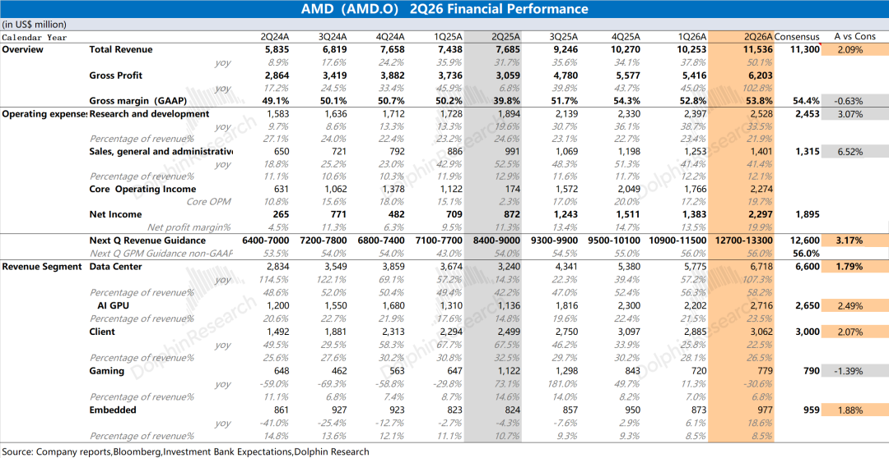

海豚君整体观点：CPU强势托底，AI集群“破局”才是关键

AMD本季度财报基本符合市场预期。公司收入端增长继续提速，主要来自于数据中心业务在本季度实现翻倍增长的带动。

数据中心业务是市场关注的核心，海豚君预估本季度AI GPU（Instinct系列）实现27亿美元左右，去年同期仅有11亿美元（其中中国管制影响大约有7亿美元）；而服务器CPU等其他部分在本季度收入达到40亿美元，同比增长80%以上，主要得益于市场在AI推理阶段加大了对服务器CPU的需求。

对于下季度指引，公司预计第三季度收入127-133亿美元，环比增长10-15%（市场预期126亿）；公司预计下季度non-GAAP毛利率56%左右（符合市场预期56%）。在其他业务相对平稳的情况下，可以预估下季度的增量主要来自于数据中心业务大约为12-18亿美元（本季度环增有10亿左右）。在MI455X开始出货的情况下，这个环增提速其实不太“亮眼”。

在本季度财报之外，市场对AMD主要关注以下几个方面：

a）大厂资本开支：云服务大厂是最主要的芯片采购方

四家CSP大厂都公布了最新的财报情况，尤其谷歌、Meta和亚马逊都再度上调了各自的资本开支。对于2026年的展望，海豚君预计五大核心云厂商（Meta、谷歌、微软、亚马逊和甲骨文）的合计资本开支有望提升至8000亿美元以上，同比增速将达到80%以上。

公司股价前段时间的大幅回调，主要是受市场对资本开支持续性“β层面”的影响。近期大厂在财报后的表现也有明显的分化，市场的关注点从“capex=增长信号，越多越好”，切换到了“capex必须被加速的变现和健康的现金流背书”，其中亚马逊和微软会相对更优质一些。由于多数大厂依然还在上调资本开支，这延续了“AI Capex的叙事”，这并未打破。

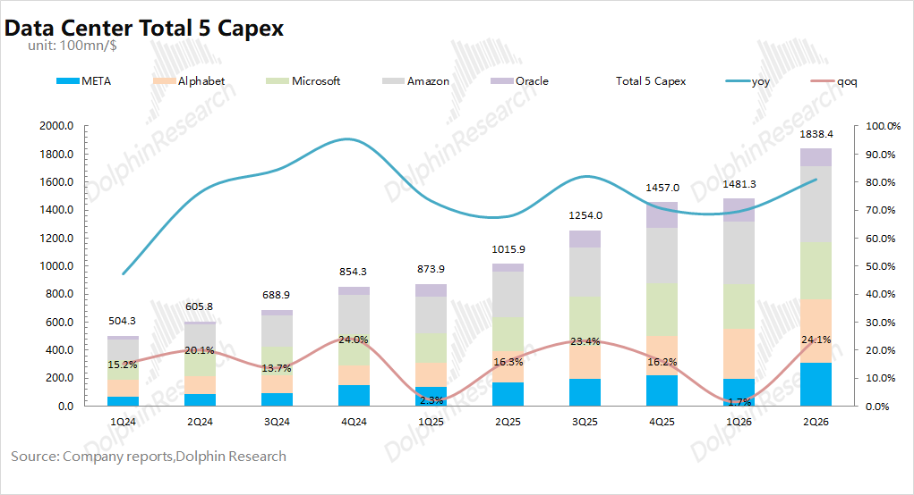

b）CPU：目前最大的基本盘

在本季度PC行业出货量同比下滑的情况下，而AMD在本季度还实现了22.5%的增长（其中涨价效应大约在10%左右），体现了公司在CPU领域竞争力的持续提升。

从整体CPU市场（包含PC和服务器领域的CPU）份额来看，近年来AMD的市场份额持续提升，尤其AMD在桌面级市场方面已经实现了对英特尔的反超。

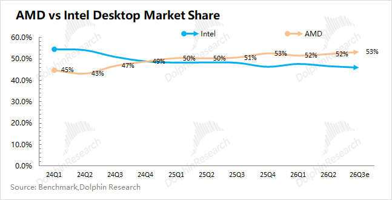

随着AI推理重要性的提升，市场增加了对服务器CPU在解决延迟及提升效率方面的需求。本季度公司服务器CPU受“量价齐升”的带动，海豚君预估均价同比提升大约有10-20%。在细分的服务器CPU市场中，AMD的市场份额已经提升至2成以上。

市场对于服务器CPU的分歧相对较小，公司管理层也给出了不错的指引。公司预计2026年下半年同比增速超80%，2027年的增速也将超过70%，是公司业绩高增长的保障。

c）AI GPU进展：MI455将在下季度开始出货

服务器CPU强劲增长已经是市场共识，而MI455X的爬坡表现才是公司估值能否从“故事”转为“现实”的关键，不论是Open AI、Meta，还是最近Anthropic的订单都主要是对算力的采购需求。

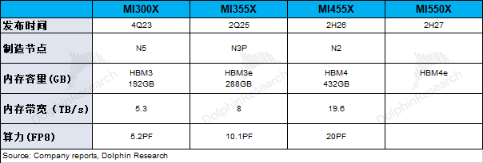

相比于MI355，AMD在MI455X系列中的变化，主要是能提供Helios机架式平台。这让公司具备了从“单芯片”到“机架级集群”的交付能力，直接对标英伟达的Rubin架构。

之前AMD的MI系列卡表现“疲软”，主要是公司难以提供“集群化部署”的方案，而“Helios机架式平台”正是大型CSP所需要的，这也让公司陆续获得了Open AI、Meta、Anthropic等大额订单（明确给出14GW）。

在此前公司已经分别从Open AI、Meta处收获了6GW的订单，在近期又宣布了与Anthropic（2GW）和微软的合作（未披露GW），这让市场开始相信公司的MI455X有望成为AI算力市场的“破局者”。

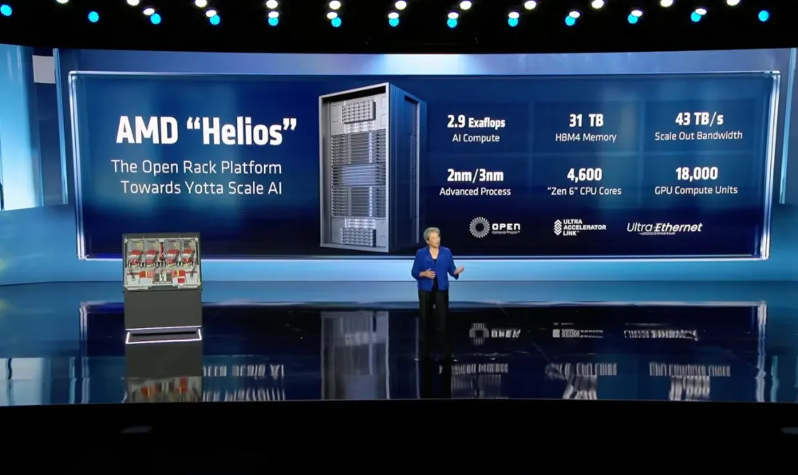

相比于上季度，海豚君上调了对公司的业绩预期，主要是因为公司获得了更多的CSP大厂订单，公司数据中心业务有望获得持续高成长。当前公司已经收获了Open AI、Meta、Anthropic和微软的订单，也表明了市场已经期待并认可下半年的MI455X/Helios产品。

当前服务器CPU已经进入景气周期，对公司业绩带来“实实在在”的业绩拉动（市场分歧较小）。至于AI GPU是公司最期待的，也是公司业绩高增及估值提升的关键，市场也聚焦在MI455X/Helios的爬坡表现之上。

AMD的估值大部分来自于对未来的期待，实际上财报后的电话会交流比业绩本身“更为重要”。

然而公司管理层并未给出“更为积极”的展望：一方面，此前几家大客户都已经打入市场预期了，而公司本次并未宣布新的大客户；另一方面，公司对未来展望并没有超出市场期待，尤其下季度MI455开始出货的情况下，环增仅仅是小幅提速，也没有明确上调全年AI GPU的指引。

公司目前的估值明显高于英伟达，主要也包含了市场对于公司能在AI 算力领域抢占份额实现高成长的期待。即使公司拿到了多家大CSP的订单，但最终还是要“落地”看到“实实在在”的业绩贡献，公司管理层在本次财报后的展望并没有给予市场足够的信心。

只有公司宣布更多的大CSP订单并给出更明确、更积极的展望，才能让市场相信MI455X/Helios的竞争力。由于本身市场对MI455X是有明显分歧的，本次财报无疑增加了MI455X竞争力的“不确定性”，这也会给公司的高估值“打个折”。

以下是详细分析

  

一、整体业绩：增长提速

1.1收入端

AMD在2026年第二季度实现营收115.4亿美元，同比增长50%，略好于市场预期（113亿美元左右）。公司本季度收入端的同比增长，主要得益于数据中心翻倍增长的带动。

服务器CPU持续提供增长动力，海豚君预估本季度AI GPU达到27亿美元，环增也开始提速，主要是由MI355X系列需求的带动。

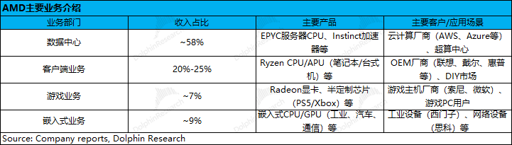

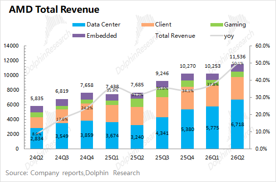

1.2毛利端

AMD在2026年第二季度实现毛利62亿美元，同比增加103%。其中本季度的毛利率（GAAP）为53.8%，去年同期受中国管制因素影响大约有8亿美元的减值影响。若剔除该影响，本季度同比提升3.5pct左右，主要受益于服务器CPU等高毛利业务占比提升的影响。

公司对下季度non-GAAP毛利率的指引为56%，环比基本持平。虽然毛利率受服务器CPU增长的带动，但MI455X从下季度开始出货，量产初期将对公司毛利率会有一定的稀释影响。

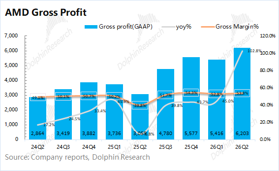

1.3经营费用

AMD在2026年第二季度的经营费用为39.3亿美元，同比增长36%。其中研发费用和销售及管理费用都有较为明显的增加。

具体费用端，拆分来看：①本季度公司的研发费用为25.3亿美元，同比增长33.5%；②本季度公司的销售及管理费用为14亿美元，同比增长41.4%。核心经营费用增长低于营收增速（50%），核心经营费用率下降至34.1%。

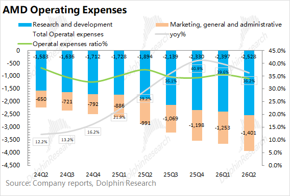

1.4利润端

由于AMD对Xilinx的收购产生了较大的递延费用，因此未来一段时间都将对侵蚀利润。而对于本季度的实际经营状况，海豚君认为“核心经营利润”更加贴近。

核心经营利润=毛利润-研发费用-销售及管理费用

在剔除收购费用等影响后，海豚君测算AMD本季度的核心经营利润为22.7亿美元，同比大幅增加。其中去年同期受中国管制因素影响大约在8亿美元左右，若不考虑该影响，核心经营利润同比也有增长133%，主要是受益于数据中心业务的增长以及毛利率回升的带动。

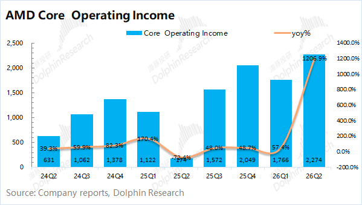

二、各业务细分：CPU高增是共识，AI GPU是关键

从公司的分业务情况看，数据中心和客户端业务是公司当前的主要业务，两者占比达到了80%以上。受益于AI GPU（MI系列）和服务器CPU需求增加，数据中心业务的占比持续提升。

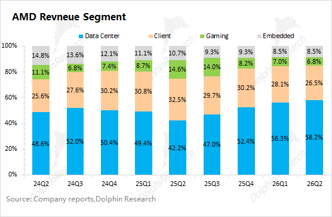

2.1数据中心业务

AMD的数据中心业务在2026年第二季度实现收入67.2亿美元，同比增长107%， 略好于市场预期（66亿美元左右），增长主要服务器CPU和AI GPU的增长带动。

结合公司及市场预期，具体拆分来看：海豚君预估本季度AI GPU收入约为27亿美元，环增5亿美元左右；服务器CPU等相关收入达到40亿美元，环比增长12%。

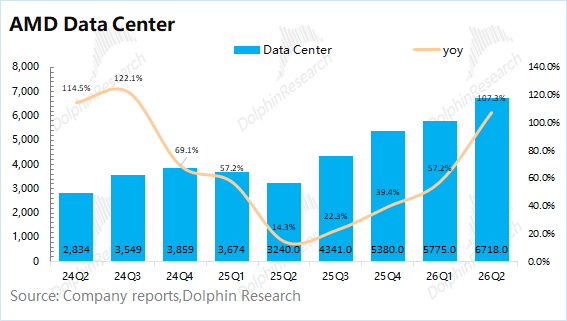

具体来看：

a）数据中心CPU：AMD凭借“CPU+GPU”的组合竞争力，公司在数据中心CPU市场的份额持续提升，已经提升至两成以上。

在当前CPU大周期之中，叠加Zen系列（Venice）的迭代升级，公司数据中心CPU业绩的高增长有望持续。公司管理层给出了下半年服务器CPU同比增长80%以上的指引，并表明2027年服务器CPU增长将达到70%以上。

b）AI GPU：当前收入主要来自于去年下半年量产的MI355X。由于MI355X系列依然是以“芯片级”进行交付的，并不是市场主流需求，AI GPU季度收入还不到30亿美元，相对较弱。

对于2026年的展望，海豚君预计五大核心云厂商（Meta、谷歌、微软、亚马逊和甲骨文）的合计资本开支有望提升至8000亿美元以上，同比增速将达到80%以上。由于多数大厂依然还在上调资本开支，这延续了“AI Capex的叙事”，这并未打破。

在公司对MI450系列的展望中，AMD计划将其深度绑定于Helios机架式平台，从而实现从“单芯片”到“机架级集群”的交付，这是直接对标英伟达的Rubin架构，也符合当下大型CSP们的主流需求。

Helios平台，整合了Venice CPU、MI455X系列GPU、Pensando网络和ROCm软件。在推理阶段，同等机架功耗下吞吐量比竞品高15%，最高每美元Token数高出30%。

当前公司已经收获了Open AI、Meta、Anthropic和微软等大客户，陆续签约大客户，让市场开始相信公司MI455X的“抢单能力”。然而公司管理层并未明确上调全年AI GPU指引（此前给的是140-150亿美元），这还是会让市场担心订单“实际落地”的情况。

2.2客户端业务

AMD的客户端业务在2026年第二季度实现收入30.6亿美元，同比增长22.5%，符合市场预期（30亿美元）。客户端业务的增长，主要得益于CPU的涨价以及公司在PC市场对英特尔份额的侵蚀。

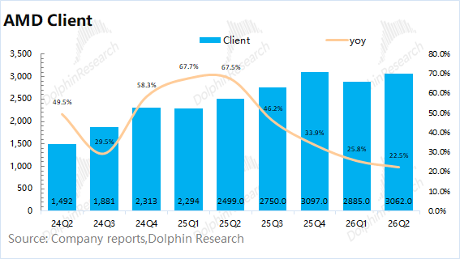

结合行业数据看，2026年第二季度全球PC出货量6820万台，同比下滑。与此同时，AMD的客户端业务能取得23%的同比增长（其中涨价效应大约在10%左右）。对比两者的增速表现，海豚君认为即便PC市场有所低迷，但AMD凭借产品竞争力，仍取得了大幅跑赢市场的表现。

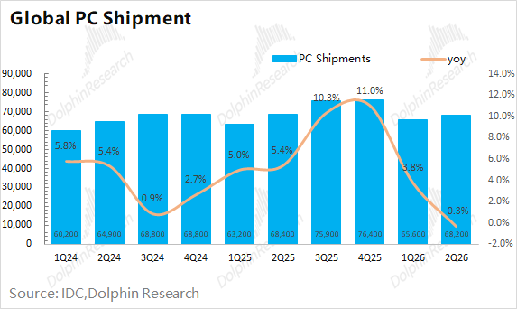

2.3其他业务

1）游戏业务：公司的游戏业务在2026年第二季度实现收入7.8亿美元，同比下滑30.6%，主要是受到主机周期的影响。按主机周期预期同比下滑，因主机周期在2026年进入第7年，处于产品升级换代的过渡期。

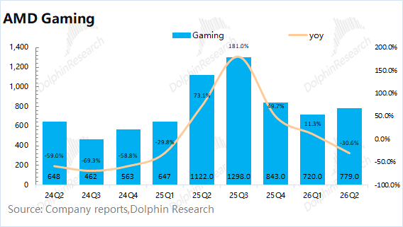

2）嵌入式业务：公司的嵌入式业务在2026年第二季度实现收入9.8亿美元，同比增长18.6%，增长由测试测量与仿真、航空航天与国防、网路、通信等方面共同驱动。

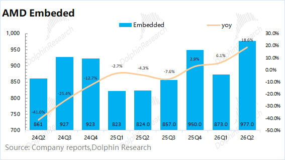

<全文结束>

  

  

\- END -

  

  

**/****/****转载** 开白

本文为海豚研究原创文章，如需转载请添加微信：dolphinR124 获得开白授权。

  

**/****/****免责声明及** 一般披露提示

本報告僅作一般綜合數據之用，旨在海豚研究及其關聯機構之用戶作一般閱覽及數據參考，並未考慮接獲本報告之任何人士之特定投資目標、投資產品偏好、風險承受能力、財務狀況及特別需求投資者若基於此報告做出投資前，必須諮詢獨立專業顧問的意見。任何因使用或參考本報告提及內容或信息做出投資決策的人士，需自行承擔風險。海豚研究毋須承擔因使用本報告所載數據而可能直接或間接引致之任何責任或損失。本報告所載信息及數據基於已公開的資料，僅作參考用途，海豚研究力求但不保證相關信息及數據的可靠性、準確性和完整性。

本報告中所提及之信息或所表達之觀點，在任何司法管轄權下的地方均不可被作為或被視作證券出售邀約或證券買賣之邀請，也不構成對有關證券或相關金融工具的建議、詢價及推薦等。本報告所載資訊、工具及資料並非用作或擬作分派予在分派、刊發、提供或使用有關資訊、工具及資料抵觸適用法例或規例之司法權區或導致海豚研究及／或其附屬公司或聯屬公司須遵守該司法權區之任何註冊或申領牌照規定的有關司法權區的公民或居民。

本報告僅反映相關創作人員個人的觀點、見解及分析方法，並不代表海豚研究及/或其關聯機構的立場。

本報告由海豚研究製作，版權僅為海豚研究所有。任何機構或個人未經海豚研究事先書面同意的情況下，均不得(i)以任何方式製作、拷貝、複製、翻版、轉發等任何形式的複印件或複製品，及/或(ii)直接或間接再次分發或轉交予其他非授權人士，海豚研究將保留一切相關權利。

  

  

  

**文章不易，点个 “分享”，给我充点儿电吧~**