英伟达 (NVDA.O)北京时间2026年8月27日凌晨，美股盘后发布2027财年第二季度财报（截至2026年7月），具体内容如下：

1.数据中心：本季度收入890亿美元，环比增量为138亿美元，好于市场预期（860亿）。增长主要是由Blackwell系列出货的带动。Rubin系列从Q3开始出货，逐步取代Blackwell，实现产品迭代升级。

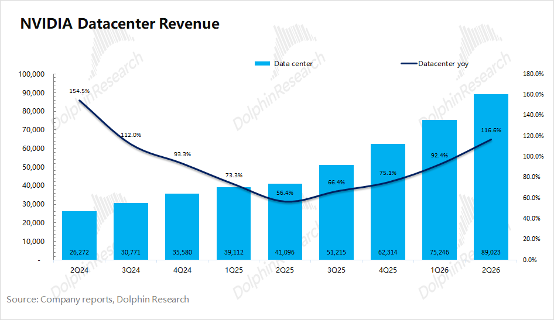

公司从本财年开始调整了披露口径，从原来细分的“计算业务和网络业务”调整成“超大规模客户和ACIE（含工业、企业和主权客户）”。具体来看，本季度超大规模客户收入487亿美元，环增57亿美元；ACIE客户业务收入403亿美元，季度环增81亿美元，是公司收入增长的最大增量。

在各家大CSP公司开始自研芯片的情况下，英伟达努力去开发和扶持中小型客户（包括政企及工业市场），并在宣布了5000亿的算力融资平台计划。

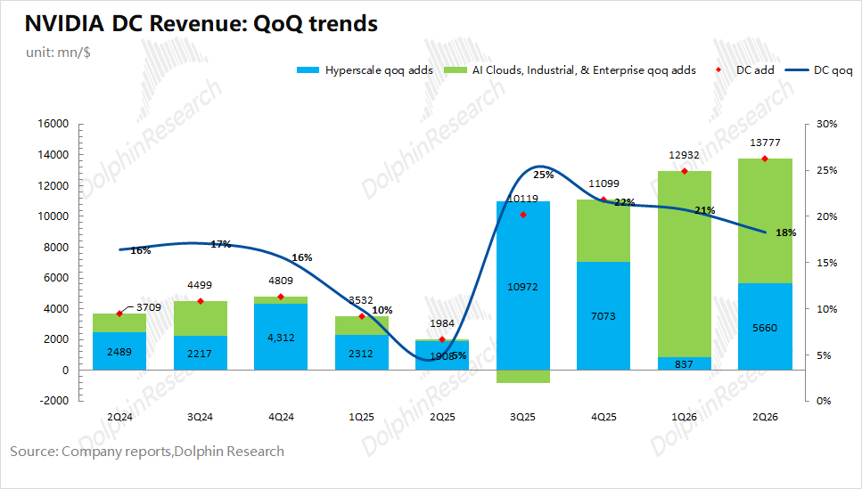

2.核心增量信息：公司在本次财报中突出了三个数据Commitments、Additional Commitments、Guarantees

1）Commitments（承诺）：是指已签约、但尚未履行的自用采购/租赁/投资义务，主要针对于上游。这数在上季度10-Q的小字中出现，而本次把它直接完整地拎了出来。

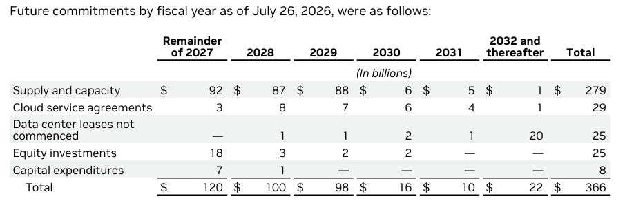

最明显的变化是采购承诺的变化，本季度公司披露的采购承诺达到2790亿美元。公司上季度披露的1190亿美元，其中950亿在2027财年，对应着2028-2031财年的供应承诺仅为240亿美元。

而本季度大幅增加的1600亿美元，主要来自于对2028-2029财年（对于2027-2028自然年）的承诺增加，这意味着公司已经提前把HBM/DRAM产能从现货市场上锁定。这可以看作是英伟达给内存供应链的合同底仓，比存储厂商的话语更为“硬气”。

2）Additional Commitments、Guarantees：都是首次披露的数据，针对于下游

①Additional Commitments（附加承诺）：为客户能买得起、建得起而签的义务，其中分为“AI cloud协议”和“代第三方签的未起租租约”两部分。

a）AI cloud的合作：英伟达卖机柜给neocloud（CoreWeave/Nebius等）从而确认收入->公司承诺买回/包销这些算力容量（对应此处360亿）->公司分成 neocloud 转售给第三方客户的收入。

b）代第三方签的未起租租约：纯粹的信用中介行为。英伟达用自己的信用去签地和电，再转手给买不到场地/电力的客户。英伟达打算把部分数据中心租约转让给第三方，如果转不出去，200亿的租赁负债在起租日就落回英伟达自己表上。

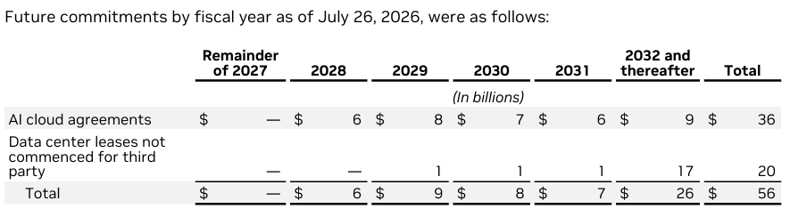

②Guarantees（担保）：承担的兜底，目前分为两块AI cloud 伙伴担保和SB Energy/PORTS-Pike。

英伟达为AI cloud 伙伴提供土地、电力等担保，风险敞口在35亿美元左右。至于俄亥俄的PORTS-Pike园区的4.25GW，20年租约下独家承载英伟达算力、承租方为 OpenAI；另有3.8GW的扩容权。

触发后的选择权在英伟达手上：公司可以自行承接租约、要求SB Energy重新出租、启动出售、允许终止，或在承担特定项目成本的前提下最多延后一年。

除非这个8月新增的超千亿的担保。原本担保不多，但也要注意，前段时间宣布的5000亿新云融资池还没有统计在内。

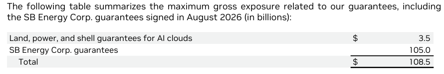

3.公司指引：公司预期2027财年第三季度（即3Q26）收入1080亿美元，环比增长118亿美元，符合上调后的买方预期（1080亿美元）；下季度毛利率（GAAP）为74%，环比下降1pct，低于市场预期（75%）。

公司管理层在后续交流中，首次明确给出2028财年收入指引，公司预计收入增速将达到70%+，大幅超出市场预期（40%左右）。盘后股价从-3%直接拉升至+5%附近。对应来看，在此前Blackwell+Rubin的同口径（2025年至2027年自然年）下从1万亿上调至1.2-1.3万亿美元。

4.经营指标：总收入962亿美元，好于上调后的买方预期（930亿美元），其中季度环比增长146亿美元，几乎都来自于数据中心业务的带动。公司本季度毛利率为75%，环比基本持平，符合市场预期（75%）。

公司本季度核心经营利润637亿美元，同比增长124%，本季度核心经营利润率也达到了66%，主要受营收高增的驱动。

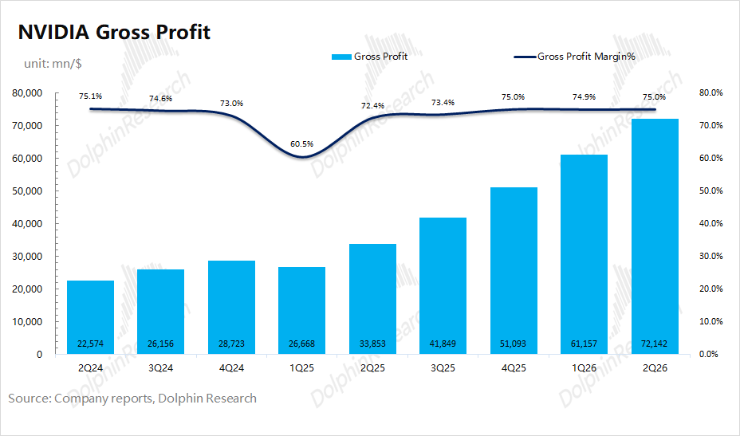

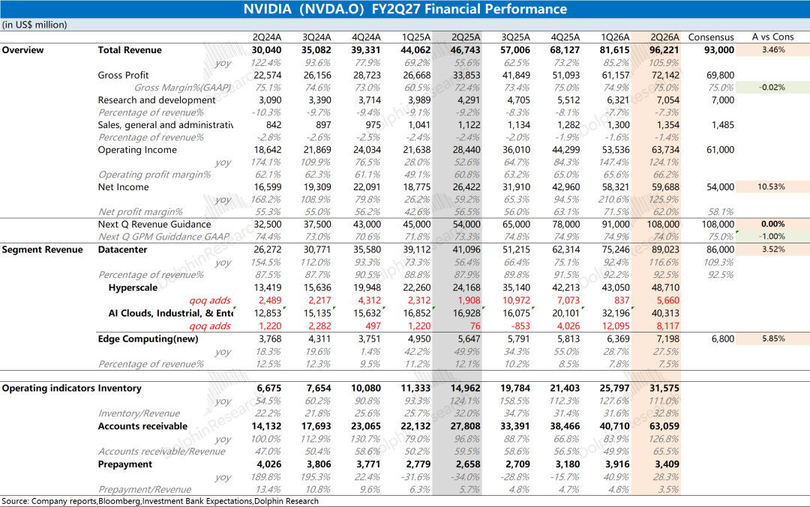

海豚君整体观点：做担保、锁产能，“70%指引”逆风翻盘

由于老黄此前已经给出了2025年至2027年（自然年）Blackwell+Rubin累计收入1万亿美元（在本次2028财年70%的指引后，实际对应上调至1.2-1.3万亿），即便是短期收入端超预期，市场其实更关注于2027/2028财年的增长表现。

对于财报，市场相对关心的指标是毛利率。公司本季度毛利率为75%，并给出了74%的下季度指引，海豚君认为毛利率回落受Rubin爬坡及内存等上游原材料等因素影响。

公司管理层在随后的交流中明确给出了2028财年（对应2027年自然年）营收增长70%+的展望，这是本次财报中最大的利好信息，直接将盘后股价大幅拉升。

在本次财报中公司还给出了核心增量信息，包括Commitments（对上游的承诺）、Additional Commitments（对下游的承诺）、Guarantees（担保）。最明显的看到，公司明确锁定了2028-2029财年的内存等上游供应量，并且努力在下游开拓市场。·

此前公司及AI行业面的较大回调，主要是受中国开源模型、Anthropic的ARR斜率等事件的影响。随着各家CSP大厂公布各自资本开支展望，谷歌、Meta和亚马逊都再度上调了全年资本开支指引，表明当前AI芯片的需求依然是相当旺盛的。

从Ticker Trends的数据来看，Anthropic的斜率有所趋缓，而Open AI依然是加速的态势。两家公司的ARR是市场对闭源模型的主要跟踪对象，也会影响市场对大型CSP未来资本开支的预期。

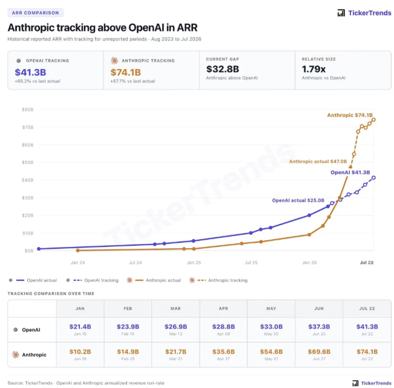

在本次财报之外，市场还关心以下方面的情况：

1）5000亿的算力融资平台

2026年8月10日，英伟达宣布与6家第三方投资机构（Apollo、BlackRock、Blackstone、Brookfield、Goldman Sachs、KKR）合作，推出超过5000亿美元的AI工厂融资平台，用于支持AI实验室、企业和云厂商建设基础设施。

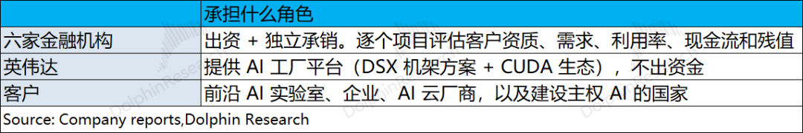

在部分项目中，英伟达可能提供最高覆盖单笔25%的残值支持机制，逐项目审慎评估。这是一个带封顶残值担保的结构化租赁/项目融资平台，英伟达把信用风险的大头推给了六家金融机构，自己保留一个25%的“残值保障”。

2）Rubin的爬坡节奏

本季度公司收入主要来自于Blackwell系列，Rubin系列目前也已经进入全面量产，仍处于量产爬坡阶段，Q4开始才成为真正的放量点。

整机柜VR200 NVL72采用了72颗Rubin GPU（单GPU中2个die）+36颗Vera CPU，NVLink总带宽260 TB/s，3.6 EFLOPS 推理/2.5 EFLOPS训练，100%液冷。

此前市场曾传言再下一代的Rubin Ultra可能延迟，近期公司IR透露Rubin Ultra并未延迟，仍按原计划推进。关注后续管理层–交流中Rubin最新的进展信息。

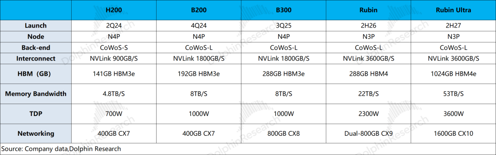

3）竞争格局

英伟达当前依然是AI芯片市场的主要领导者，市场份额达到7成以上。不容忽视的是，在大模型重心转向推理侧的情况下，英伟达的优势是有所削弱的。

由于推理阶段对算力要求相对较弱，各家大型云厂商纷纷开始了定制ASIC芯片，AMD也准备推出MI450X Helios机架级系统，这些都主要针对于推理市场。

实际上公司已经对数据中心收入拆成“超大规模厂商”和“ACIE”两部分，公司近两个季度的主要增量并非来自于大型CSP。只有大厂有能力定制ASIC芯片，而中小型客户并没有这样的能力，附加承诺、担保和5000亿融资平台都能为这类客户带来支持。

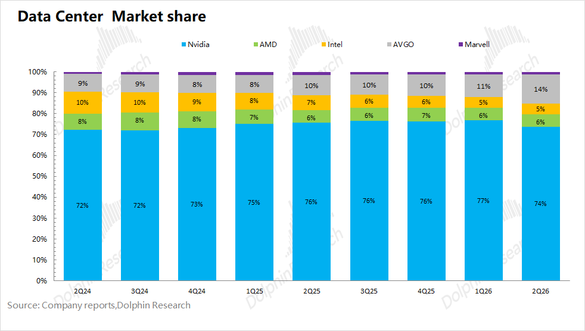

参考英伟达当前市值（5.1万亿美元），对应公司2028财年税后核心经营利润约为13倍PE（假定两年营收复合同比+85%，毛利率73%，税率16.5%）。其实老黄之前已经给出了数据中心业务展望，公司在2026-2028财年的高增长是相对确定的，尤其是本次直接给出2028财年同增70%+的展望。

公司当前的13xPE实在不高，但估值迟迟没能得以提升，主要是市场对以下方面的担心：后续大厂资本开支的回落、市场地位/毛利率能否维持、业绩是否见顶或增长大幅回落。

以上这些问题虽然还没有明确的答案，大厂资本开支需要关注ARR和经济性、市场地位/毛利率需要关注AMD及定制ASIC的进展，但英伟达已经开始了主动调整，公司将数据中心拆分为大厂和ACIE（含工业、企业和主权客户）两部分，ACIE目前已经为公司贡献最主要的增量。

本季度公司披露的Commitments、Additional Commitments、Guarantees以及近期的5000亿融资平台，很明显公司已经在构建一个完整的结构体系，“L1供应承诺（上游产能）->L2附加承诺（客户的场地/电力/可融资现金流）->L3担保（客户的信用等级）->L4融资平台（全球长期资本的准入）”。这个就是算力供给和融资央行的角色。

整体来看，公司本次最大的亮点是，直接给出了2028财年的营收展望（同增70%+）。至于短期的季度业绩并不重要，并且Rubin从四季度开始才是真正放量点。

出于市场对公司的担忧（大厂资本开支、市场竞争、英伟达在新云建设中的算力“央行”角色），公司的估值并不高，这也给公司在之前行业整体下跌中带来支撑。公司在本次财报中主要给出了承诺、担保等增量数据，表明公司也在积极争取上游供应保障和下游客户开拓。

公司本次直接给出2028财年增长指引，表明了公司强烈的信心。只要市场的担忧没有真正化解的话，还是会对公司股价带来压制。而即便参考此前市场给予公司的估值区间来看，当前仍有一定的修复空间。

海豚君对英伟达财报数据及相关图表：

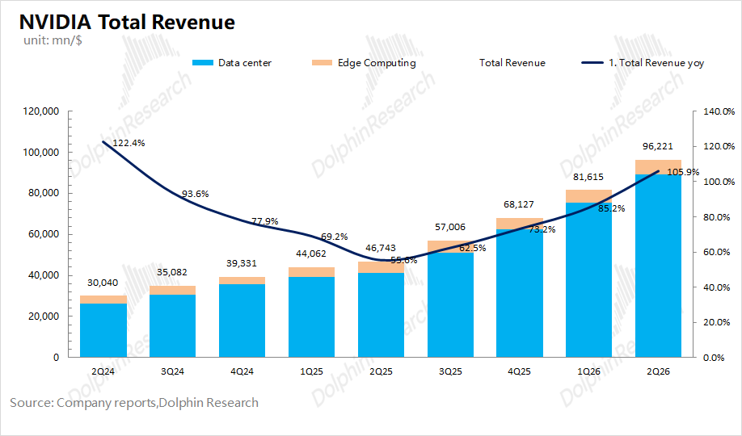

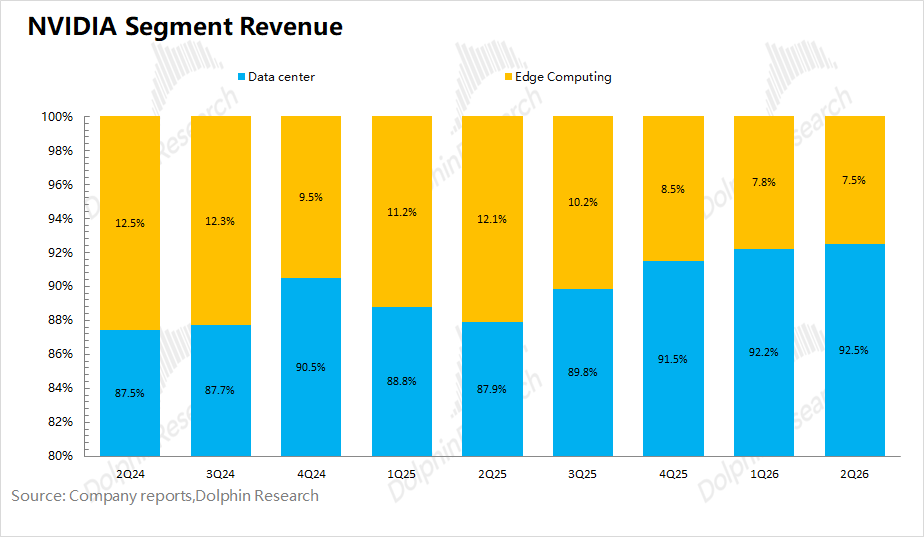

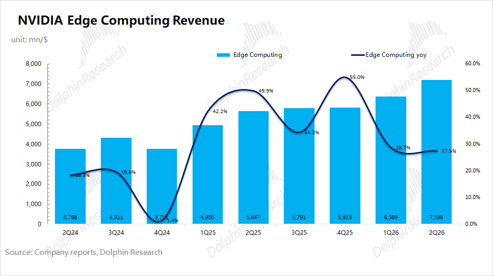

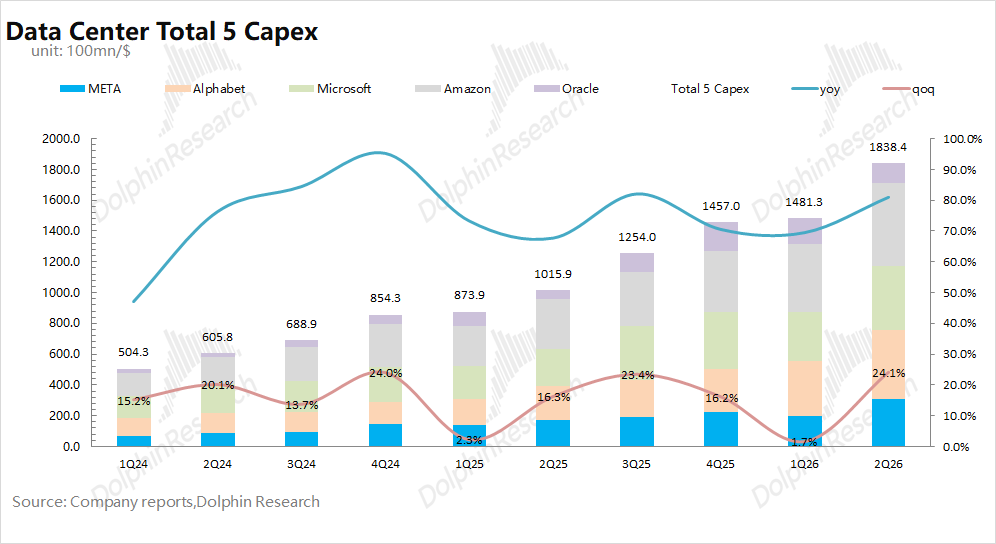

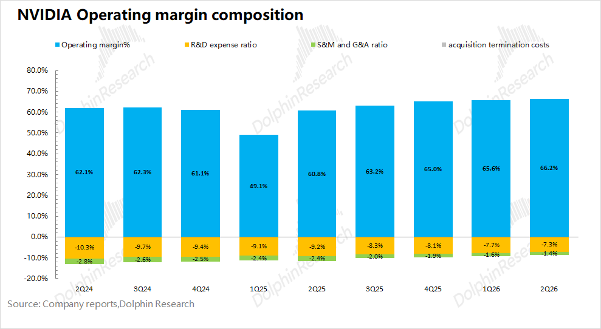

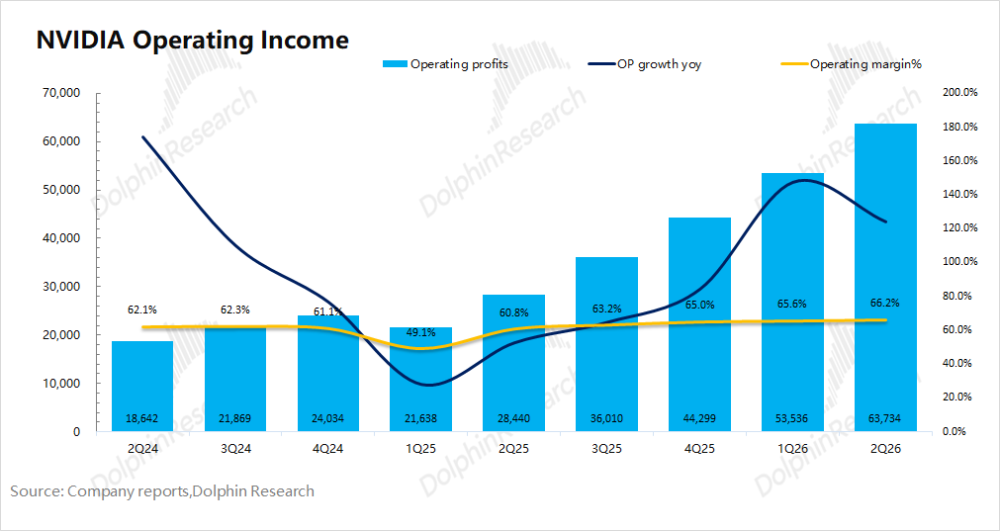

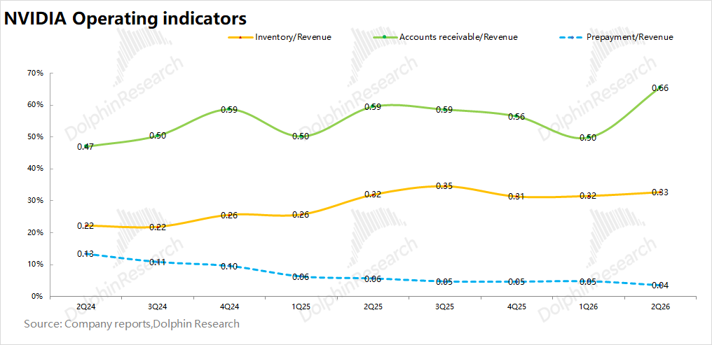

<本文结束>

  

  

  

\- END -

  

  

  

**/****/****转载** 开白

本文为海豚研究原创文章，如需转载请添加微信：dolphinR124 获得开白授权。

  

**/****/****免责声明及** 一般披露提示

本報告僅作一般綜合數據之用，旨在海豚研究及其關聯機構之用戶作一般閱覽及數據參考，並未考慮接獲本報告之任何人士之特定投資目標、投資產品偏好、風險承受能力、財務狀況及特別需求投資者若基於此報告做出投資前，必須諮詢獨立專業顧問的意見。任何因使用或參考本報告提及內容或信息做出投資決策的人士，需自行承擔風險。海豚研究毋須承擔因使用本報告所載數據而可能直接或間接引致之任何責任或損失。本報告所載信息及數據基於已公開的資料，僅作參考用途，海豚研究力求但不保證相關信息及數據的可靠性、準確性和完整性。

本報告中所提及之信息或所表達之觀點，在任何司法管轄權下的地方均不可被作為或被視作證券出售邀約或證券買賣之邀請，也不構成對有關證券或相關金融工具的建議、詢價及推薦等。本報告所載資訊、工具及資料並非用作或擬作分派予在分派、刊發、提供或使用有關資訊、工具及資料抵觸適用法例或規例之司法權區或導致海豚研究及／或其附屬公司或聯屬公司須遵守該司法權區之任何註冊或申領牌照規定的有關司法權區的公民或居民。

本報告僅反映相關創作人員個人的觀點、見解及分析方法，並不代表海豚研究及/或其關聯機構的立場。

本報告由海豚研究製作，版權僅為海豚研究所有。任何機構或個人未經海豚研究事先書面同意的情況下，均不得(i)以任何方式製作、拷貝、複製、翻版、轉發等任何形式的複印件或複製品，及/或(ii)直接或間接再次分發或轉交予其他非授權人士，海豚研究將保留一切相關權利。

  

  

  

**文章不易，点个 “分享”，给我充点儿电吧~**