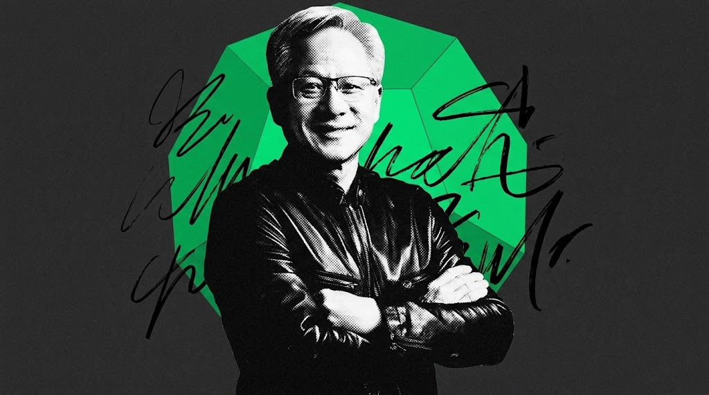
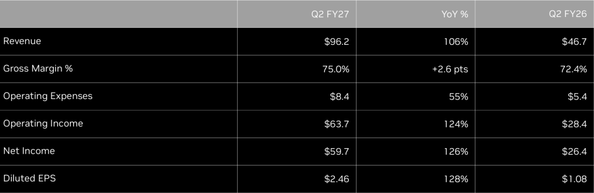
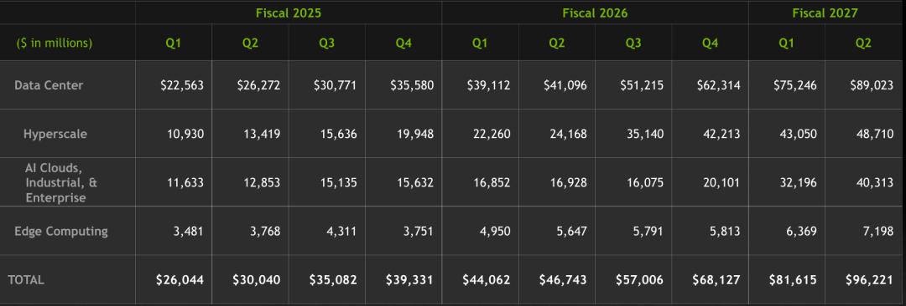
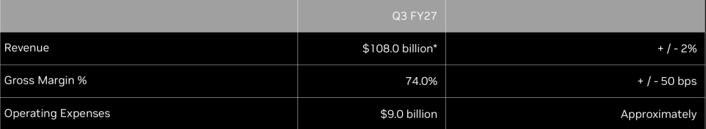
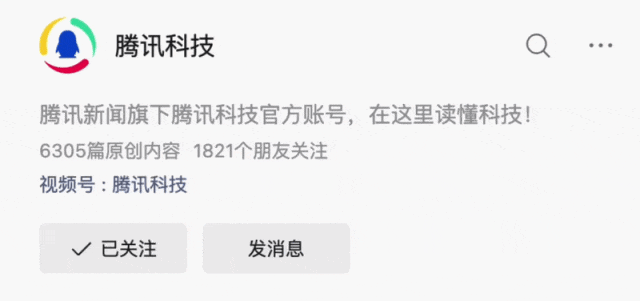

英伟达CEO黄仁勋，图片经由AI处理

文｜苏扬

编辑｜徐青阳

英伟达再次交出了一份亮眼财报，营收、运营利润和每股收益均创下历史新高。

美国当地时间8月26日，英伟达公布截至2026年7月26日的2027财年第二财季业绩。财报显示，英伟达当季营收达到962.21亿美元，同比增长106%，环比增长18%；净利润达到596.88亿美元，同比增长126%；摊薄后每股收益为2.46美元，同比增长128%。

相比上一季度816.15亿美元的营收，英伟达继续刷新增长纪录。上年同期，该公司单季营收仅为467.43亿美元，如今一年时间几乎实现了翻倍增长。

财报公布后，英伟达盘后股价一度下跌约1.3%，随后跳涨超4%，这也反映出市场关注点的分歧和变化：过去投资者关注的是英伟达能否持续超越预期，如今他们更关心AI基础设施建设还能持续多久，以及下一代芯片和新的商业模式能否支撑未来增长。

从盈利能力来看，英伟达依然保持着极高水平。

第二财季，公司运营利润达到637.34亿美元，同比增长124%；按Non-GAAP口径计算，净利润为539.54亿美元，同比增长118%。同期，公司毛利率达到75%，高于去年同期的72.4%，也略高于第一财季的74.9%。

英伟达创始人兼CEO黄仁勋表示：“人工智能已经到达了拐点。它正在做有用的工作，它的token正在创造生产力和盈利能力。现在，计算就是收入。”

现在，更多AI实验室、初创企业正在快速扩张，开源模型生态以及物理AI等新方向也开始发展，整个AI产业正在进入更广泛的建设周期。

与此同时，英伟达继续加大股东回报力度。第二财季，该公司通过股票回购和现金股息向股东返还约260亿美元。截至季度末，公司股票回购授权额度仍剩余约990亿美元。

01

数据中心收入激增，AI云客户增长更快

推动英伟达这一轮增长的核心依然是数据中心业务。

在第二财季，英伟达数据中心收入达到890.23亿美元，同比增长117%，环比增长18%，几乎贡献了公司全部营收增量。随着全球企业和云服务商持续投入AI基础设施建设，英伟达GPU需求仍处于高位。

英伟达第一财季调整了数据中心业务披露方式，将客户分为Hyperscale和ACIE两大类别。

其中，超大规模客户（Hyperscale）收入达到487.1亿美元，同比增长102%，环比增长13%，主要来自大型公有云和互联网公司。

与此同时，AI云、工业与企业客户（ACIE）收入达到403.13亿美元，同比增长138%，环比增长25%。该业务覆盖AI原生公司、企业客户、主权AI客户以及使用AI云服务的超大规模计算需求。

新的分类方式显示，AI算力需求正在从少数云巨头向企业、政府和更多行业场景扩散。不过，投资者仍关注不同客户类型背后的盈利能力和长期需求，而不仅仅是订单规模的增长。

中国大陆市场仍然是财报中的重要变量。

英伟达表示，第二财季运往中国大陆的数据中心Hopper产品收入占数据中心收入比例低于1%。同时，该公司在第三财季业绩展望中，没有计入任何来自中国大陆的数据中心计算收入。

除了数据中心业务，边缘计算业务第二财季收入达到71.98亿美元，同比增长27%，环比增长13%。其中，Blackwell工作站销售推动增长，但消费级PC受到内存和系统价格上涨影响，部分抵消了增长。

02

Blackwell Ultra放量，Vera Rubin全面投产

英伟达正在推动产品路线从单一GPU升级到完整计算平台。

第二财季，Blackwell Ultra成为推动数据中心业务增长的重要因素。英伟达表示，当季数据中心收入增长主要来自Blackwell Ultra基础设施的大规模部署。随着云服务商和AI企业持续建设大规模AI计算集群，Blackwell正在进入更广泛的商业部署阶段。

与此同时，英伟达已经开始为下一代产品周期做准备。第二财季，该公司宣布Vera Rubin平台已经全面投产，相关机架系统正在CoreWeave、Google Cloud等合作伙伴云平台运行。

Rubin平台不仅包括GPU，还覆盖CPU、网络、软件以及系统级解决方案。其中，Vera CPU是英伟达推出的首款针对AI智能体设计的CPU，该产品计划被全球领先技术提供商采用。

此外，英伟达还宣布，用于交互式AI推理的NVIDIA Groq 3 LPX已经全面投产。英伟达希望通过Groq 3 LPX等产品加强在实时AI推理场景中的竞争能力。

除了硬件产品，英伟达也在强化软件生态。

第二财季，该公司推出DSX平台，为基础设施建设者提供设计、建设和运营大规模AI工厂的完整方案。该平台将计算、网络、软件以及系统进行整合，帮助客户建设更大规模的AI基础设施。

在AI软件方面，英伟达持续扩展NVIDIA Agent Toolkit，并通过PhysicsNeMo以及CUDA-X库增强开发能力。该公司表示，正在与全球软件平台提供商合作，推出新软件、开源模型和合作伙伴项目。

对于英伟达而言，产品竞争已经不再局限于单个芯片性能，而是围绕从芯片、网络、软件到系统的完整生态展开。不过，市场仍在关注Blackwell向Rubin过渡的速度，以及新一代平台能否继续推动客户扩大AI基础设施投入。

03

AI基础设施进入融资阶段，英伟达承担更多建设角色

随着AI数据中心规模不断扩大，英伟达正在参与更多基础设施建设。

第二财季财报显示，截至2026年7月26日，英伟达未来承诺金额达到3600亿美元。其中包括2790亿美元供应与产能承诺、290亿美元云服务协议、230亿美元资本支出，以及250亿美元股权投资。

上述承诺主要与未来AI基础设施扩张有关。其中，最受关注的是英伟达参与的SB Energy俄亥俄州PORTS-Pike项目。

英伟达表示，该公司为SB Energy位于俄亥俄州的技术园区提供信用支持，该项目初期涉及约4.25GW土地、电力和厂房建设，用于托管OpenAI的英伟达基础设施。英伟达提供的担保义务最高达到1050亿美元，并将在数据中心达到可服务状态等条件满足后分阶段生效。

与此同时，英伟达正在推动更大规模的AI基础设施资本投入。该公司已经宣布与Apollo、BlackRock、Blackstone、Brookfield、Goldman Sachs和KKR等机构建立战略合作伙伴关系，目标是在未来动员超过5000亿美元第三方资本，用于AI基础设施建设。

黄仁勋认为，AI基础设施建设正在进入新的阶段，未来需要大量资本投入，以支持AI模型训练、推理以及更多应用的发展。

不过，随着英伟达参与更多基础设施项目，市场也开始关注这种模式带来的资本压力。

截至第二财季末，英伟达现金、现金等价物和有价债务证券合计566亿美元。与此同时，该公司第二财季发行了250亿美元高级无担保票据，用于一般企业用途。英伟达表示，目前公司的财务状况依然稳健，未来投资主要围绕支持供应链、基础设施和长期增长需求展开。

04

Q3营收将超千亿，竞争压力开始显现

对于下一季度，英伟达给出了继续增长的预期。

该公司预计2027财年第三季度营收将达到1080亿美元，上下浮动2%；预计GAAP和Non-GAAP口径下毛利率均为74%。英伟达同时强调，该指引没有计入任何来自中国的数据中心计算收入。

相比第二季度962亿美元营收，英伟达预计第三季度仍将保持增长。不过，市场关注点已经从单季度增长转向长期竞争格局。

目前，AI芯片市场竞争正在扩大。英伟达在财报中强调，该公司正在通过完整计算平台保持优势，包括处理器、互连技术、软件、算法、系统和服务。公司希望通过这一整套生态满足AI训练和推理需求。

但与此同时，竞争对手正在加快布局。AMD持续推出数据中心产品，谷歌也在发展自研TPU芯片。大型科技公司既是英伟达的重要客户，同时也在投入资源开发自己的计算平台。

投资者尤其关注AI推理市场的发展。随着AI应用增加，计算需求正在从模型训练扩展到推理服务。英伟达通过Vera Rubin平台、Groq 3 LPX以及软件生态强化推理能力，希望继续保持市场领先地位。

不过，未来增长仍需要回答几个问题：Blackwell Ultra和Rubin平台能否继续推动客户增加采购；AI基础设施投资是否能够保持当前速度；以及随着客户自研芯片增加，英伟达在AI计算市场中的份额是否会受到影响。

962亿美元营收，是英伟达在AI浪潮中的又一个里程碑。

对于英伟达而言，创纪录的财务数据证明了过去周期的成功，而下一阶段的挑战，是如何在AI产业进入更大规模建设阶段后，继续保持自己的核心位置。

推荐阅读

[比尔·盖茨万字长文警告：动荡的AI时代已经到来，这次不一样](https://mp.weixin.qq.com/s?__biz=Mjc1NjM3MjY2MA==&mid=2691572087&idx=1&sn=53e973e3f9425c6b87f6c8d0776694e7&scene=21#wechat_redirect)

[黄仁勋、奥特曼、孙正义“抱团20年”](https://mp.weixin.qq.com/s?__biz=Mjc1NjM3MjY2MA==&mid=2691571846&idx=1&sn=a6a848055567816cf2f30382eced80e6&scene=21#wechat_redirect)

一键关注,明天见| 看完点个爱心点个赞  
---|---