  

微软7 月 30 早美股盘后，发布了截至今年 6 月的 2026 财年四季报。一句话，AI 风水轮流转，这次终于轮回到微软长松一口气了。

**1、作为回收 AI 投资的最重要落脚点：Azure 本季同增加速到 43%（剔 FX 也是一样），而** 一些偏乐观的报告也就预期到 40-42%。更重要的是，下季度不变汇率增长指引给到了 45%，意味着 Azure 会继续加速增长。

Codex 近期猛追后，OAI 7 月 ARR 收入已高出整个二季度，这对微软云服务本身也是一个不错利好。

**2、Capex（含资本租赁）410 亿，下季度 500 亿，都没意外。** 而 26 自然年 1900 亿 Capex 下降到 1750 亿更多是会计 “小心思”，实际指引没变。而市场上一些人以为地微软会上调资本开始，海豚君一开始就不这么认为，主要是微软投得早。谷歌都拉高资本开支其实是在补功课。

**3、难得一个现金流没崩的云巨头！** 公司经营流入单季 550 亿，公司 410 亿 Capex 中还有 56 亿的资本租赁性投入，实际现金支出性资本开支不足 360 亿，所以本季公司还有接近 200 亿的自由现金流。

**4、利润竟然稳如狗？** 没有 AI Capex 进入摊折期的逻辑大幅压制毛利率的鬼故事、运营上整个 26 年还有裁员降本为 AI 让道，公司经营利润率没有下降，甚至有点小幅上扬。经营利润做到了 406 亿美金，同增 18%，小超收入 17.7% 的增速。

**5\. 新签合同还不错：** 新签了 774 亿，没了 OAI 这个单一大客户，签单也开始恢复性增长。公司单季确认的 to B 云收入一共也才 593 亿。 新签订单金额超当季确认收入，必然意味着待履约企业合同余额（RPO）越积越多。这个季度增加 500 亿，总余额到了 6780 亿。

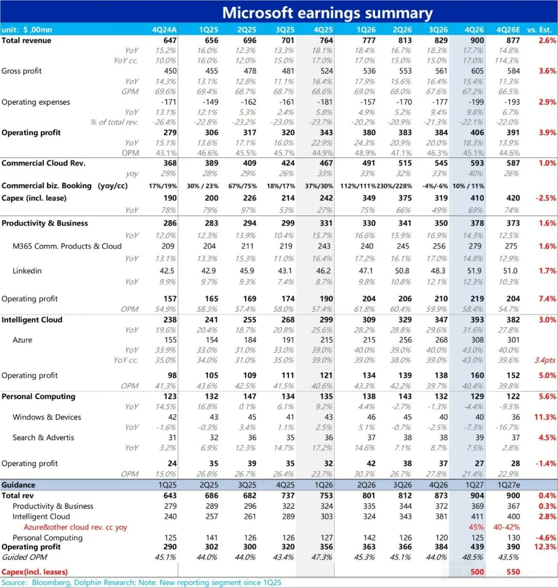

**海豚君观点**

2023 年，微软是 OAI 爆红背后的真正受益人，从 OAI 的云用量、微软办公等生产力软件 AI 化，微软风光无二。

但接着微软和 OAI 开始貌合神离，Azure 增速放缓；微软的办公软件 AI 化落地难产、与 OAI 割席后微软模型、芯片自研都较弱，微软开始被资本市场嫌弃，估值受到压制。

本次财报后，微软模型、芯片自研的情况并没改善，但 Azure 增长加速度相对较快，而新签订单也在快速回血，一定程度上，说明进入后 OAI 时代，微软客户多元化逐步开始有所成效。

对应报表上：**一个 AI 投入克制（Capex 不拉高）、AI 增长有力（Azure 加速增长超预期 + 新签订单额开始回血）、利润率不塌、现金流不崩的云公司，相对同行又有一定估值折价，当下的微软已经变得很香。**  

接下来，大客户 OAI 7 月 GPT 5.6 模型发布，带动云用量加速；公司 6 月也对 Github Copilot 做了涨价（从月费转向按用量计费），以及接近 6800 亿的合同履约余额，意味着微软或许已开始走出与 OAI 的 “离婚低迷期”。

  

**以下是财报详细点评**

**  
**

**一、财报披露口径变化概览**

25 财年开始微软对财报披露的部门结构做出不小的调整。整体的调整思路是把面向企业的各类 365 服务，包括 Commercial Office 365, Windows 365 和 Security 365，全部从各自的原板块调整到了生产力&流程（PBP）大板块下。具体的调整变化，和海豚君的看法请见1Q25 点评，下图是简要概括，就不再赘述。

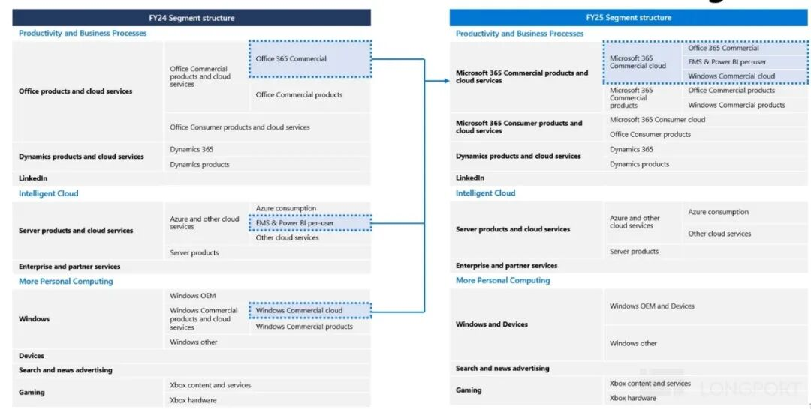

**二、签单上来了**

云生意，签单金额、以及合同余额，与收入确认额一样重要。之前新签订单同增直接转负，搞得市场很慌。还好本季度又开始回归了。

海豚君估算下来，本季度的签单金额应该超过微软整个云端业务（SaaS 云和 PaaS 云），这样的速度必然会导致合同余额越来越高。

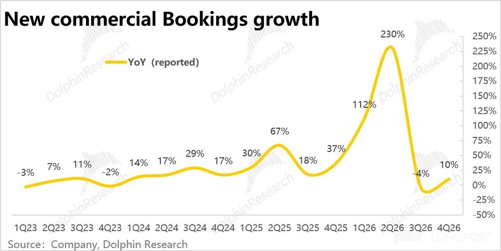

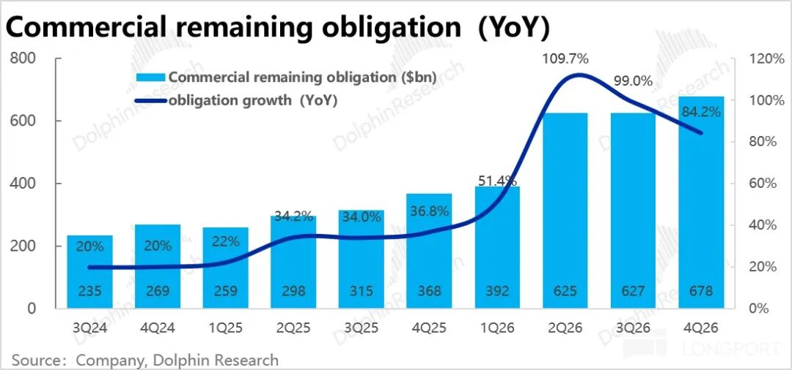

**二、摊折费用没上来、现金流不错**

微软资本开支是 410 亿，但其中有些是资本租赁形式的资本开支（现金流出和费用错配较小），真正的现金性资本开支是 365 亿美金。

但海豚君注意到，虽然微软作为 AI 资本开支的先行者，微软到现在摊销折旧额并未大幅上扬，这个季度相比去年同期几乎零增，这也是公司毛利率下滑幅度不大的原因之一。

而从三个季度前，公司的资本开支中短周期资产（服务器等）占比逐步上升，从 50% 现在持续拉到 2/3 以上之后，海豚君倾向于认为后续微软的摊销折旧额反噬还没有到来。

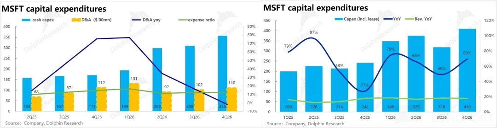

而微软相比其他巨头本季度优异的地方在于：虽然资本开支额大幅走高，但公司本身就是一个现金制造机，经营现金流单季四五百亿美金，因此 300-400 亿的 capex 付现额，还不足击穿微软的经营现金流。

微软本季度虽然自由现金流已经同比回落了 23%，但仍有 196 亿美金。

按照目前公司给出的资本开支指引，海豚君按照明年大约 18% 左右的经营现金流增长，以及大约 2100 亿的资本开支，倾向于认为 2027 财年全年维度，公司的自由现金流应该能勉强守住。

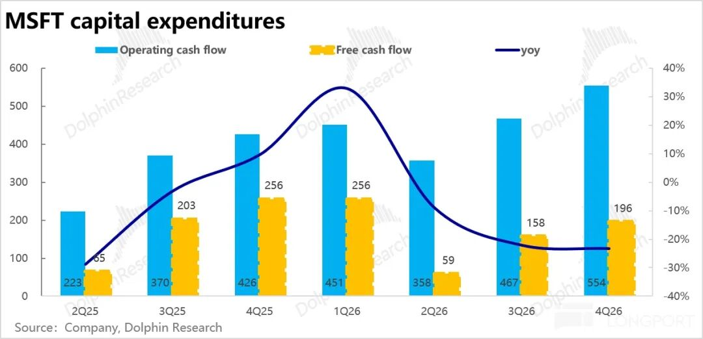

**三、分板块表现： 云撑成长，生产力工具托底，个人计算惨兮兮**

**1.1 云：Azure 要加速度了、盈利也不掉链子**

云投入盯回报的集中点——Azure 本季营收同比增长 43%，剔汇率影响后同为 43%，市场上乐观的预期也没有超 42%。下季度指引 45%，确实是加速趋势。但市场原本也就预期 42% 上下。

而根据公司指引的今年下半年会整体比上半年加速增长、公司越积越多的合约余额 +capex 中服务器到位投产，**海豚君认为大概率 Azure 经历微软 OAI 分手的低迷期后，已确定性重启加速度模式。**

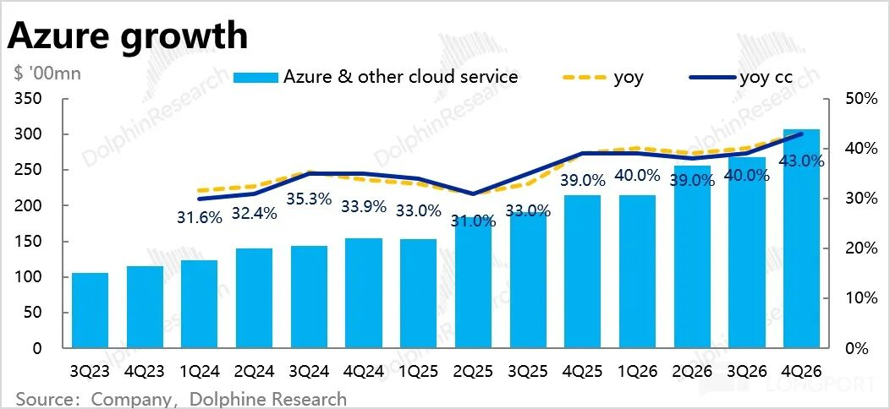

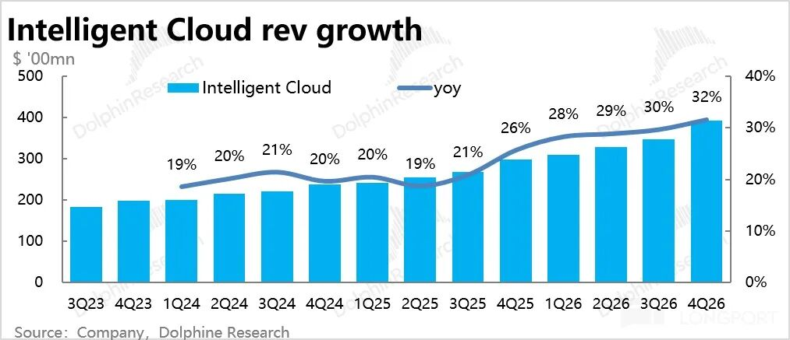

**1.2 生产力板块：稳如狗**

重要性第二的**商业微软 365 云服务** （Microsoft 365 Commercial Cloud）**本季收入增长小幅放缓到 14%** 。

产品销售策略上，从 E3 到 E5，再到如今的 E7，策略明显是通过做高附加值产品渗透率的做产品综合 ASP 的名降实升。

尤其是新推的 E7 其实就是在办公软件的基础上，把单独定价 30 美元的 M Copilot 功能，以及 Agent 功能加进去了，再加上升级的安全功能，**单独卖要 120 美元上下，微软给月打包报价，也就是 E7，是 99 美元。**

但当下，微软的 SaaS 没有出现软件末日的景象，但让用户为 AI 附加值买单的速度推进得也不算理想。

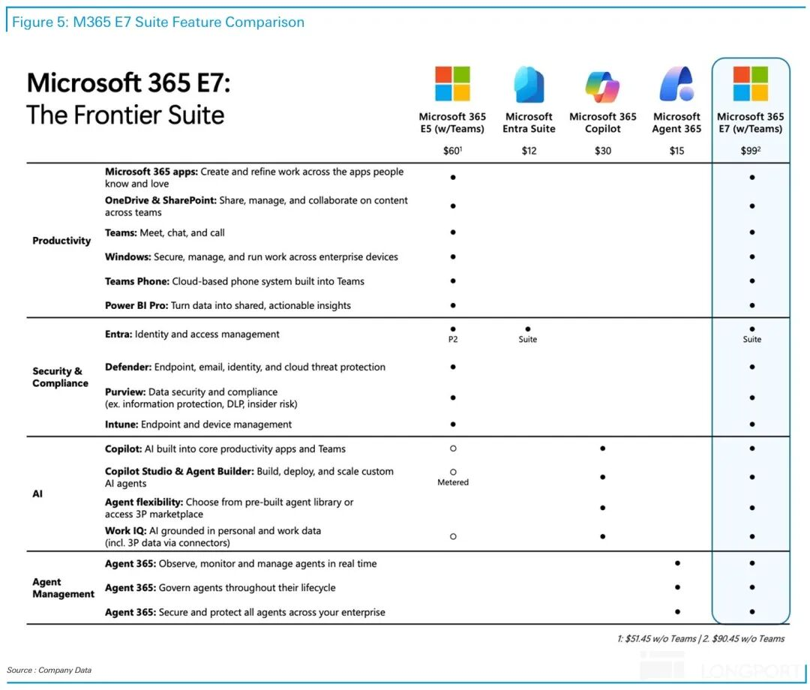

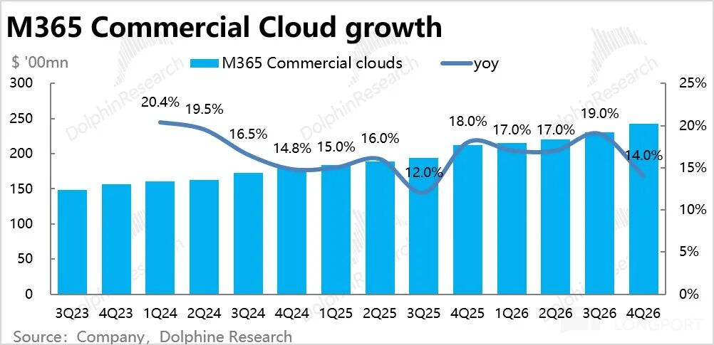

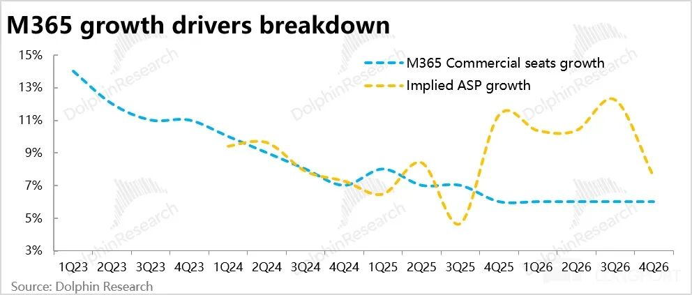

而 to B 微软 365 服务所在的**生产力流程板块剔汇率影响后，从上季度 13% 增长小幅回归到 14%，几个季度下来基本稳如狗。**

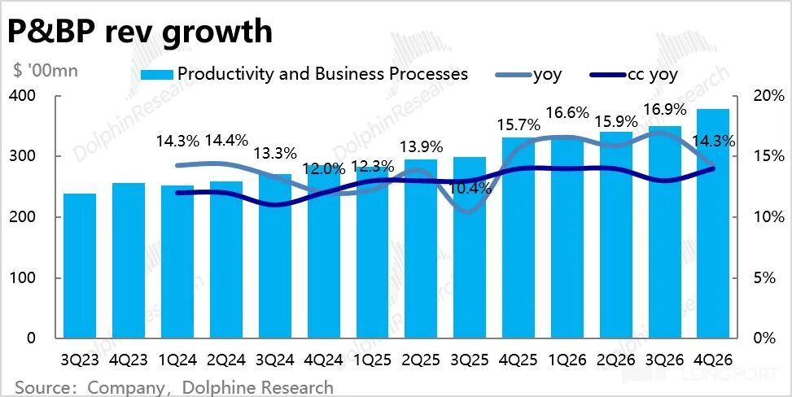

**1.3 个人业务：全卷最差**

本季度个人板块的增长下滑了 5% ，比预期的 10% 稍微好了一些。PC 因为原材料涨价难卖已经是事实，市场预期的是 Windows 业务要跌 15% 以上，实际同比下滑了 7%。

游戏业务收缩最多，Bing 搜索与 Windows 等其他广告业务同比增长仅仅 7%（剔汇率 10%），搜索业务并没有因为 AI 翻盘，谷歌仍旧绝对一哥。

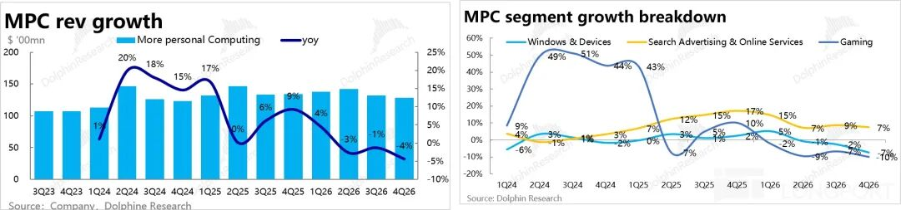

微软集团整体本季度营收$900 亿，同比增长 17.7%，略高于卖方一致预期的 15%。但剔除汇率利好后，真实营收增速为 17%，各个板块实际业绩都比预期的稍好一点。

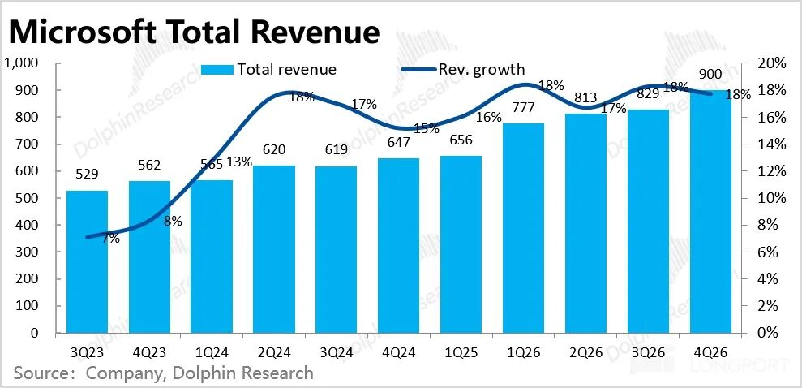

**四、云业务毛利率结构性走低，稳利润率靠经营杠杆**

1）毛利率结构趋势非常明显，云业务因为本身收入最大，又增速最高，AI 贡献占比拉升过程中持续压低云业务的毛利率。

因此市场做预测的时候，对云业务的毛利率预测多是环比持续性走低，但本季度云业务来了个意外抬头，这个是整体毛利率超预期的重要原因。

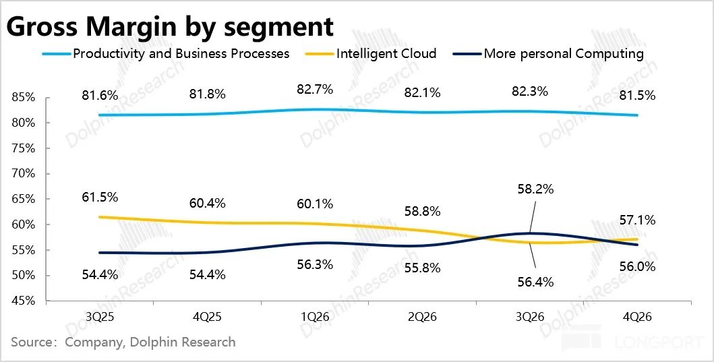

2）本季度整体经营利润为$406 亿，同比增长了 18%，比收入增长基本一致。在毛利率结构性走低的情况下，利润增长主要是靠经营杠杆。

收入的高增稀释了研发费用和销售费用的增长，而从人头上来看，这个财年，微软员工减少了五千人，减少到了 12.3 万人，也是很明显的裁撤人头换成 AI 投入。

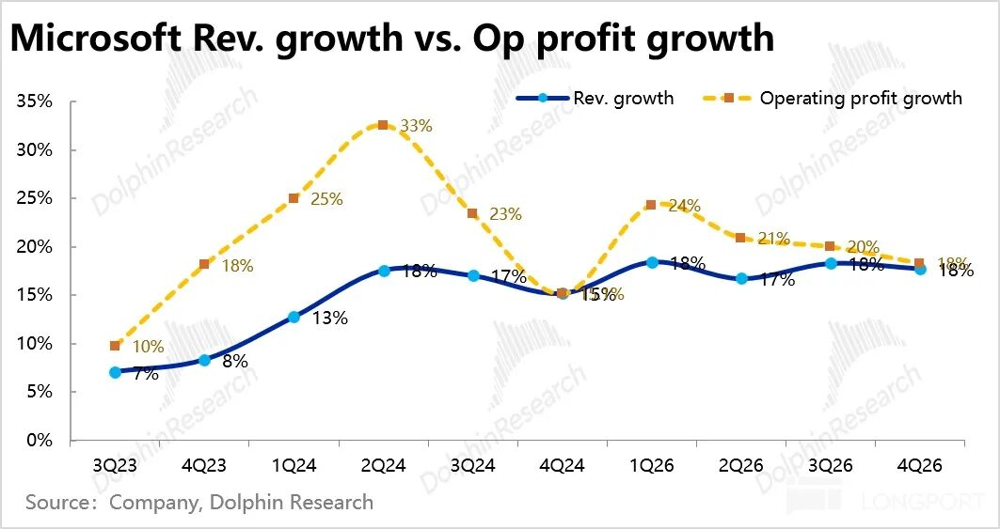

2）分板块来看，更多个人计算的利润贡献基本忽略，微软主要是就是生产力 SaaS+ 云业务。

云虽是收入主力，但利润创造上，还不及 Office 等 SaaS 的利润创造能力。当前 Office 业务在通过搭售 Copilot 的方式来提高 ASP，利润率有走低的趋势，本季度是。

最受关注、也是主要承担 Capex 和折旧的**智慧云板块经营利润率** 为 40.4%，**同比维稳，比较超预期。**

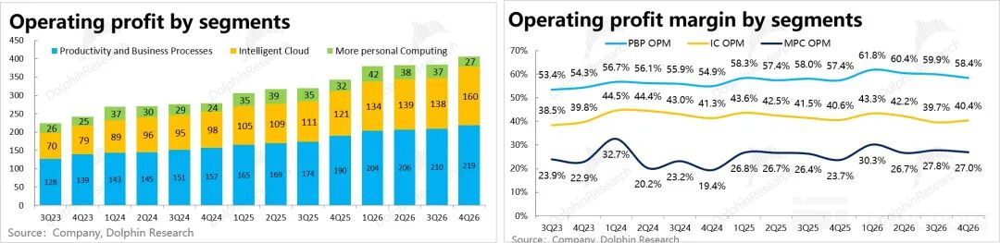

<正文结束>

  

  

\- END -

  

  

  

**/****/****转载** 开白

本文为海豚研究原创文章，如需转载请添加微信：dolphinR124 获得开白授权。

  

**/****/****免责声明及** 一般披露提示

本報告僅作一般綜合數據之用，旨在海豚研究及其關聯機構之用戶作一般閱覽及數據參考，並未考慮接獲本報告之任何人士之特定投資目標、投資產品偏好、風險承受能力、財務狀況及特別需求投資者若基於此報告做出投資前，必須諮詢獨立專業顧問的意見。任何因使用或參考本報告提及內容或信息做出投資決策的人士，需自行承擔風險。海豚研究毋須承擔因使用本報告所載數據而可能直接或間接引致之任何責任或損失。本報告所載信息及數據基於已公開的資料，僅作參考用途，海豚研究力求但不保證相關信息及數據的可靠性、準確性和完整性。

本報告中所提及之信息或所表達之觀點，在任何司法管轄權下的地方均不可被作為或被視作證券出售邀約或證券買賣之邀請，也不構成對有關證券或相關金融工具的建議、詢價及推薦等。本報告所載資訊、工具及資料並非用作或擬作分派予在分派、刊發、提供或使用有關資訊、工具及資料抵觸適用法例或規例之司法權區或導致海豚研究及／或其附屬公司或聯屬公司須遵守該司法權區之任何註冊或申領牌照規定的有關司法權區的公民或居民。

本報告僅反映相關創作人員個人的觀點、見解及分析方法，並不代表海豚研究及/或其關聯機構的立場。

本報告由海豚研究製作，版權僅為海豚研究所有。任何機構或個人未經海豚研究事先書面同意的情況下，均不得(i)以任何方式製作、拷貝、複製、翻版、轉發等任何形式的複印件或複製品，及/或(ii)直接或間接再次分發或轉交予其他非授權人士，海豚研究將保留一切相關權利。

  

  

  

**文章不易，点个 “分享”，给我充点儿电吧~**