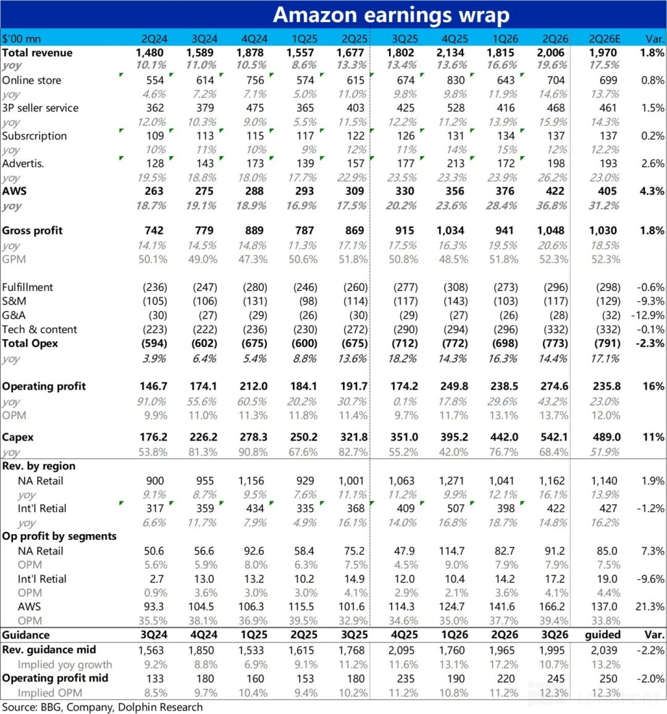
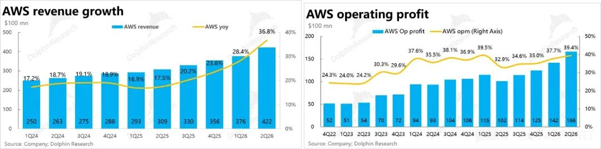
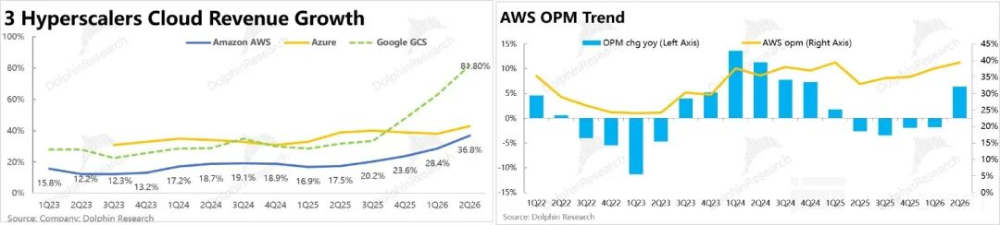
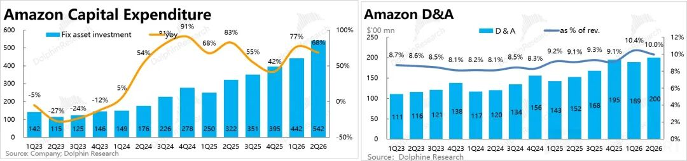
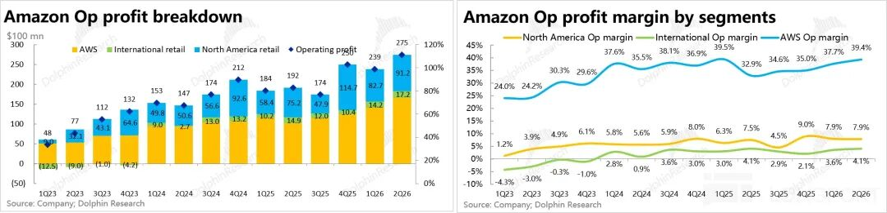
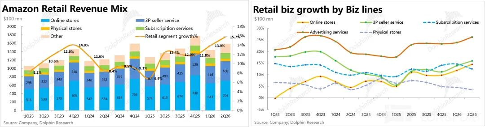
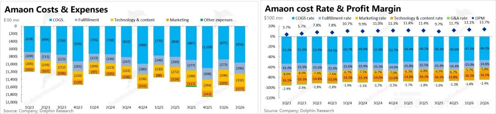

  

巨头接连放榜，亚马逊于北京时间 7 月 31 日美股盘后，发榜了 2026 年第二季度的财报。它的结果确实应了海豚君上季度说的，现在轮到亚马逊表演了！

**1、AWS 要飙了？** 同增直接从 28% 拉高到 37%，到$422 亿。从 AWS 走出的 Anthropic ARR 飙涨，为 AWS 带来了肉眼可见的好处。

更重要的是，与多数云公司不同的是，AWS 收入加速度，利润率也在加速度：环比拉升 1.7 个百分点，**已经跑到了 39.4%** ，接近历史新高了。

**2、合同余额：** 已经达到了 4690 亿，环比新增千亿美金。海豚君毛估下来，新签订单 1500 亿，显著超出微软。合同余额越积越多，而新签订单额远超确收额，也意味着收入随着产能释放，AWS 的收入增长必然会加速度。

**3、Capex 猛冲：** 单季环增已近百亿，绝对值明显是巨头第一。不过由于亚马逊的零售生意也是重资产的，实际投在云上的体量，应该与谷歌 450 亿上下的水平差不多。

全年目标因存储涨价，从 2000 亿拉到了 2200 亿，后面两个季度，单季资本开支要奔 600 亿了。这样的单季支出量也意味着，AI 基建的投资在回调之后还能继续起舞。

**4、现金流已崩：** 由于单季运营流入只有 450 亿，单季 530 亿，以及后续 600 亿的资本开支，必然意味着自由现金流持续、深度转负。

**因为现金流崩掉，公司系统** 性解释了当前投入产出的衡量逻辑，核心判断其实与海豚君之前分析谷歌《[“审判” 谷歌：市场善变，还是猛投有罪？](https://mp.weixin.qq.com/s?__biz=MzE5MTU3MzA2OQ==&mid=2247574931&idx=1&sn=6114f6ce1705f257a0997abbee251585&scene=21#wechat_redirect)》时一致：

a. 公司是拿在 “确定” 在手订单来计算投产比，产能出来就能把合同额转为确收额;

b. 资本开支中，长周期资产厂房等拉高了前置投入额，但因折旧周期长，其实一直可以用；服务器、网络设备等短周期资产可基于需求，提前采买就行了；现在大规模采买是因为在手订单高。

c. 服务器等短周期资产回本周期是 3 年上下，使用年限 5-6 年，3 年之后就会出现自由现金流了。

不过在海豚君看来，这中间涉及订单毁约的惩罚机制，以及上游采购合同违约机制，对上游的采购订单与对下游的合同余额之间的期限错配等等。虽然解释确实有理有据，加深了大家的理解，但并非就扫清质疑了。  

本质上市场担心的还是 AWS 客户的客户的支付能力，而且这个支付能力不能只是靠 AI 替代人力的降本增效逻辑来挪腾预算，而是 AI 真正创造增量收入。但为客户的客户创造增量收入上，目前答案并不清晰。

**5、资本开支会到顶吗？** 亚马逊偏自营零售业务，海豚君按资本开支/毛利来估算资本开支强度已是 50%。很多人怀疑这样是否资本开支到顶了？毕竟接着继续拉高资本开支，都不是消耗利润的问题，基本是直接拿着绝大多数的收入去投了。

但听过亚马逊的解释，海豚君认为的资本开支预测，应该是基于各家云巨头的在手订单来判断，只要订单余额持续高额累积，围绕 Capex 的投资逻辑就还有希望，但在手订单的本质还是要靠模型的进步来推动。

**6、 折旧会反噬利润吗？有可能。** 本季度摊折费用 200 亿，占收入比重 10%，这两个季度高位趋稳；费用相比 500 亿 + 的 Capex 现金流出仍然是不小差距，考虑到目前资本开支结构中短周期的服务器等资产占比较高，后续折旧压力肯定提高，主要靠收入加速度来摊薄了。

**7、零售很不错：** 因为 Prime Day 前置，亚马逊零售业务表现也超出海豚君预期，同增加速到 16%。同时北美零售利润率稳在 7.9%，国际零售基本稳定在 4.1%，表现一般。成本上行对亚马逊零售的侵蚀并不明显。结构上，毛利丰厚的广告占比越来越高，对零售毛利率也是持续的正向利好。

**8、当季很漂亮，但指引一般：** 下季度收入指引增长同比最多也就 12%，公司解释主要是因为 Prime Day 提前到二季度影响了三季度的数据。利润指引也只有 225-265 亿美金，也没超出市场预期。  

海豚君自己估算下来，按这个指引，云业务无论是收入还是利润应该加速弹性并不大，但考虑到亚马逊从来就是 Beat 指引，业绩只有 Beat 的幅度上的区别，海豚君觉得这个指引仅做参考。

**海豚君整体观点**

总结起来很简单：零售不错、云很猛，指引一般，但在云开飙、亚马逊总是保守指引的预期之下，市场对这样的指引也不在意。

其实，核心问题还是对云投入产出比，现金流投到告急的担心，公司这波体系性的解释不仅是在解释自己，其实是在为整个 CSP 们代言，确实也起到了安慰市场的作用。

公司更是直接给出了两个自己的关注数字：AI 收入和芯片销售收入两条线年化各自已达 250 亿，其中 AI 收入同增三位数；上个季度，芯片销售收入年化是 200 亿。

海豚君毛估算下来，在 AWS 这个季度 37% 的同比增速当中，AI 对增长的拉升幅度和传统业务应该是对半开。  

而自研芯片，正如海豚君上季度所言，推理时代，亚马逊同样想讲一个自研硬件对内降本，对外单体创收的故事，而且目前虽然模型不行，硬件线确实走得也不错。

综上可以看出，进入推理时代，Agent+Coding 的落地，2026 年的亚马逊云上的布局（投资 Anthropic 绑定云用量 + 自研硬件）已开始见效，亚马逊的云业务会进入相对确定的上行周期，接下来增长加速斜率其实要看订单堆积速度和产能释放速度。而零售业务只要稳住不拖后腿就行。

后续的跟踪重点仍然是 Anthropic 的 ARR 持续上飙会是一个侧面的印证信号。

  

**相关图表如下：**

**1\. AWS：漂亮的收入和利润增长曲线**

**2\. 猛增的资本开支 vs 慢爬坡的摊折**

(注意：资本开支未算资产变卖的流入项)

**3\. 零售的皮相，云的魂：利润全靠云来撑**

**4\. 零售：Prime Day 前置；广告风光，自营不错，3P、广告都在线**

**5\. 费用：除了研发，其他都很克制**

<正文结束>

  

  

\- END -

  

  

**/****/****转载** 开白

本文为海豚研究原创文章，如需转载请添加微信：dolphinR124 获得开白授权。

  

**/****/****免责声明及** 一般披露提示

本報告僅作一般綜合數據之用，旨在海豚研究及其關聯機構之用戶作一般閱覽及數據參考，並未考慮接獲本報告之任何人士之特定投資目標、投資產品偏好、風險承受能力、財務狀況及特別需求投資者若基於此報告做出投資前，必須諮詢獨立專業顧問的意見。任何因使用或參考本報告提及內容或信息做出投資決策的人士，需自行承擔風險。海豚研究毋須承擔因使用本報告所載數據而可能直接或間接引致之任何責任或損失。本報告所載信息及數據基於已公開的資料，僅作參考用途，海豚研究力求但不保證相關信息及數據的可靠性、準確性和完整性。

本報告中所提及之信息或所表達之觀點，在任何司法管轄權下的地方均不可被作為或被視作證券出售邀約或證券買賣之邀請，也不構成對有關證券或相關金融工具的建議、詢價及推薦等。本報告所載資訊、工具及資料並非用作或擬作分派予在分派、刊發、提供或使用有關資訊、工具及資料抵觸適用法例或規例之司法權區或導致海豚研究及／或其附屬公司或聯屬公司須遵守該司法權區之任何註冊或申領牌照規定的有關司法權區的公民或居民。

本報告僅反映相關創作人員個人的觀點、見解及分析方法，並不代表海豚研究及/或其關聯機構的立場。

本報告由海豚研究製作，版權僅為海豚研究所有。任何機構或個人未經海豚研究事先書面同意的情況下，均不得(i)以任何方式製作、拷貝、複製、翻版、轉發等任何形式的複印件或複製品，及/或(ii)直接或間接再次分發或轉交予其他非授權人士，海豚研究將保留一切相關權利。

  

  

  

**文章不易，点个 “分享”，给我充点儿电吧~**